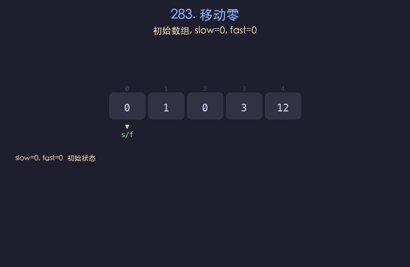
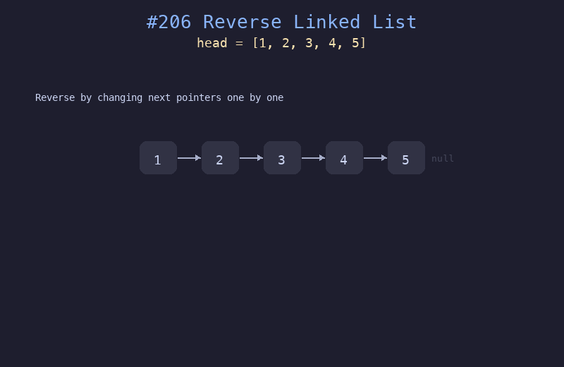
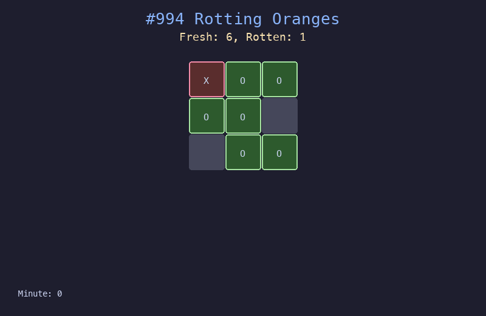

# LeetCode 75 算法可视化

用动图（GIF）直观展示 LeetCode 75 道经典算法题的执行过程。每道题包含：题目描述、解题思路、Python 代码、动画演示、复杂度分析。

> 📚 基于 [LeetCode 75 Study Plan](https://leetcode.com/studyplan/leetcode-75/)，按 22 个专题分类。

## 目录

### 数组 / 字符串

| # | 题目 | LeetCode |
|---|------|----------|
| 001 | [合并交替字符串](problems/001_合并交替字符串/) | #1768 |
| 002 | [字符串的最大公因子](problems/002_字符串的最大公因子/) | #1071 |
| 003 | [拥有最多糖果的孩子](problems/003_拥有最多糖果的孩子/) | #1431 |
| 004 | [种花问题](problems/004_种花问题/) | #605 |
| 005 | [反转字符串中的元音字母](problems/005_反转字符串中的元音字母/) | #345 |
| 006 | [反转字符串中的单词](problems/006_反转字符串中的单词/) | #151 |
| 007 | [除自身以外数组的乘积](problems/007_除自身以外数组的乘积/) | #238 |
| 008 | [递增的三元子序列](problems/008_递增的三元子序列/) | #334 |
| 009 | [压缩字符串](problems/009_压缩字符串/) | #443 |

### 双指针

| # | 题目 | LeetCode |
|---|------|----------|
| 010 | [移动零](problems/010_移动零/) | #283 |
| 011 | [判断子序列](problems/011_判断子序列/) | #392 |
| 012 | [盛最多水的容器](problems/012_盛最多水的容器/) | #11 |
| 013 | [K和数对的最大数目](problems/013_K和数对的最大数目/) | #1679 |

### 滑动窗口

| # | 题目 | LeetCode |
|---|------|----------|
| 014 | [子数组最大平均数 I](problems/014_子数组最大平均数I/) | #643 |
| 015 | [定长子串中元音的最大数目](problems/015_定长子串中元音的最大数目/) | #1456 |
| 016 | [最大连续1的个数 III](problems/016_最大连续1的个数III/) | #1004 |
| 017 | [删掉一个元素以后全为1的最长子数组](problems/017_删掉一个元素以后全为1的最长子数组/) | #1493 |

### 前缀和

| # | 题目 | LeetCode |
|---|------|----------|
| 018 | [找到最高海拔](problems/018_找到最高海拔/) | #1732 |
| 019 | [寻找数组的中心下标](problems/019_寻找数组的中心下标/) | #724 |

### 哈希表 / 哈希集合

| # | 题目 | LeetCode |
|---|------|----------|
| 020 | [找出两个数组的不同](problems/020_找出两个数组的不同/) | #2215 |
| 021 | [独一无二的出现次数](problems/021_独一无二的出现次数/) | #1207 |
| 022 | [确定两个字符串是否接近](problems/022_确定两个字符串是否接近/) | #1657 |
| 023 | [相等行列对](problems/023_相等行列对/) | #2352 |

### 栈

| # | 题目 | LeetCode |
|---|------|----------|
| 024 | [从字符串中移除星号](problems/024_从字符串中移除星号/) | #2390 |
| 025 | [行星碰撞](problems/025_行星碰撞/) | #735 |
| 026 | [字符串解码](problems/026_字符串解码/) | #394 |

### 队列

| # | 题目 | LeetCode |
|---|------|----------|
| 027 | [最近的请求次数](problems/027_最近的请求次数/) | #933 |
| 028 | [Dota2 参议院](problems/028_Dota2参议院/) | #649 |

### 链表

| # | 题目 | LeetCode |
|---|------|----------|
| 029 | [删除链表的中间节点](problems/029_删除链表的中间节点/) | #2095 |
| 030 | [奇偶链表](problems/030_奇偶链表/) | #328 |
| 031 | [反转链表](problems/031_反转链表/) | #206 |
| 032 | [链表最大孪生和](problems/032_链表最大孪生和/) | #2130 |

### 二叉树 - DFS

| # | 题目 | LeetCode |
|---|------|----------|
| 033 | [二叉树的最大深度](problems/033_二叉树的最大深度/) | #104 |
| 034 | [叶子相似的树](problems/034_叶子相似的树/) | #872 |
| 035 | [统计二叉树中好节点的数目](problems/035_统计二叉树中好节点的数目/) | #1448 |
| 036 | [路径总和 III](problems/036_路径总和III/) | #437 |
| 037 | [二叉树中的最长交错路径](problems/037_二叉树中的最长交错路径/) | #1372 |
| 038 | [二叉树的最近公共祖先](problems/038_二叉树的最近公共祖先/) | #236 |

### 二叉树 - BFS

| # | 题目 | LeetCode |
|---|------|----------|
| 039 | [二叉树的右视图](problems/039_二叉树的右视图/) | #199 |
| 040 | [最大层内元素和](problems/040_最大层内元素和/) | #1161 |

### 二叉搜索树

| # | 题目 | LeetCode |
|---|------|----------|
| 041 | [二叉搜索树中的搜索](problems/041_二叉搜索树中的搜索/) | #700 |
| 042 | [删除二叉搜索树中的节点](problems/042_删除二叉搜索树中的节点/) | #450 |

### 图 - DFS

| # | 题目 | LeetCode |
|---|------|----------|
| 043 | [钥匙和房间](problems/043_钥匙和房间/) | #841 |
| 044 | [省份数量](problems/044_省份数量/) | #547 |
| 045 | [重新规划路线](problems/045_重新规划路线/) | #1466 |
| 046 | [除法求值](problems/046_除法求值/) | #399 |

### 图 - BFS

| # | 题目 | LeetCode |
|---|------|----------|
| 047 | [迷宫中离入口最近的出口](problems/047_迷宫中离入口最近的出口/) | #1926 |
| 048 | [腐烂的橘子](problems/048_腐烂的橘子/) | #994 |

### 堆 / 优先队列

| # | 题目 | LeetCode |
|---|------|----------|
| 049 | [数组中的第K个最大元素](problems/049_数组中的第K个最大元素/) | #215 |
| 050 | [无限集中的最小数字](problems/050_无限集中的最小数字/) | #2336 |
| 051 | [最大子序列的分数](problems/051_最大子序列的分数/) | #2542 |
| 052 | [雇佣K位工人的总代价](problems/052_雇佣K位工人的总代价/) | #2462 |

### 二分查找

| # | 题目 | LeetCode |
|---|------|----------|
| 053 | [猜数字大小](problems/053_猜数字大小/) | #374 |
| 054 | [咒语和药水的成功对数](problems/054_咒语和药水的成功对数/) | #2300 |
| 055 | [寻找峰值](problems/055_寻找峰值/) | #162 |
| 056 | [爱吃香蕉的珂珂](problems/056_爱吃香蕉的珂珂/) | #875 |

### 回溯

| # | 题目 | LeetCode |
|---|------|----------|
| 057 | [电话号码的字母组合](problems/057_电话号码的字母组合/) | #17 |
| 058 | [组合总和 III](problems/058_组合总和III/) | #216 |

### 动态规划 - 一维

| # | 题目 | LeetCode |
|---|------|----------|
| 059 | [第 N 个泰波那契数](problems/059_第N个泰波那契数/) | #1137 |
| 060 | [使用最小花费爬楼梯](problems/060_使用最小花费爬楼梯/) | #746 |
| 061 | [打家劫舍](problems/061_打家劫舍/) | #198 |
| 062 | [多米诺和托米诺平铺](problems/062_多米诺和托米诺平铺/) | #790 |

### 动态规划 - 多维

| # | 题目 | LeetCode |
|---|------|----------|
| 063 | [不同路径](problems/063_不同路径/) | #62 |
| 064 | [最长公共子序列](problems/064_最长公共子序列/) | #1143 |
| 065 | [买卖股票的最佳时机含手续费](problems/065_买卖股票的最佳时机含手续费/) | #714 |
| 066 | [编辑距离](problems/066_编辑距离/) | #72 |

### 位运算

| # | 题目 | LeetCode |
|---|------|----------|
| 067 | [比特位计数](problems/067_比特位计数/) | #338 |
| 068 | [只出现一次的数字](problems/068_只出现一次的数字/) | #136 |
| 069 | [或运算的最小翻转次数](problems/069_或运算的最小翻转次数/) | #1318 |

### 字典树

| # | 题目 | LeetCode |
|---|------|----------|
| 070 | [实现 Trie 前缀树](problems/070_实现Trie前缀树/) | #208 |
| 071 | [搜索推荐系统](problems/071_搜索推荐系统/) | #1268 |

### 区间

| # | 题目 | LeetCode |
|---|------|----------|
| 072 | [无重叠区间](problems/072_无重叠区间/) | #435 |
| 073 | [用最少数量的箭引爆气球](problems/073_用最少数量的箭引爆气球/) | #452 |

### 单调栈

| # | 题目 | LeetCode |
|---|------|----------|
| 074 | [每日温度](problems/074_每日温度/) | #739 |
| 075 | [在线股票跨度](problems/075_在线股票跨度/) | #901 |

---

## 示例效果

### 移动零（双指针）


### 反转链表


### 腐烂的橘子（BFS）


---

## 如何使用

```bash
# 安装依赖
pip install Pillow

# 生成所有动图
python3 generate_all.py

# 或生成单题
python3 problems/001_合并交替字符串/solution.py
```

## 项目结构

```
leetcode-visualize/
├── README.md              # 本文件
├── viz_lib.py             # 共享可视化库
├── generate_all.py        # 批量生成脚本
└── problems/
    ├── 001_合并交替字符串/
    │   ├── README.md      # 题解
    │   ├── solution.py    # 可视化脚本
    │   └── solution.gif   # 动画
    ├── 002_字符串的最大公因子/
    │   └── ...
    └── 075_在线股票跨度/
        └── ...
```
