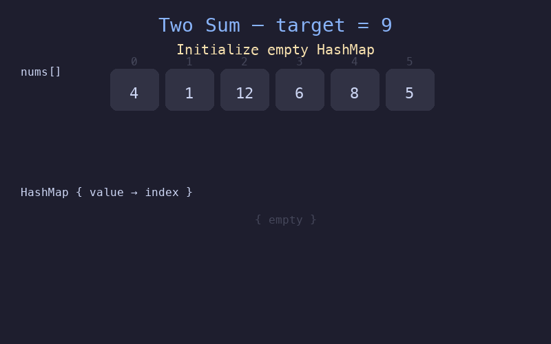

# LeetCode Visualize

LeetCode 算法可视化，用动图展示算法执行过程。

## Two Sum

**题目**: 给定一个整数数组 `nums` 和一个目标值 `target`，找出数组中和为目标值的两个数的下标。

**解法**: 使用 HashMap，一次遍历，时间复杂度 O(n)。



**算法步骤**:
1. 遍历数组，对于每个元素计算 `complement = target - nums[i]`
2. 检查 `complement` 是否已存在于 HashMap 中
3. 如果存在，返回两个下标；否则将当前元素加入 HashMap

```python
def twoSum(nums, target):
    hashmap = {}
    for i, num in enumerate(nums):
        complement = target - num
        if complement in hashmap:
            return [hashmap[complement], i]
        hashmap[num] = i
```

## 生成动图

```bash
python3 generate_two_sum.py
```

需要 Python 3 和 Pillow (`pip install Pillow`)。
