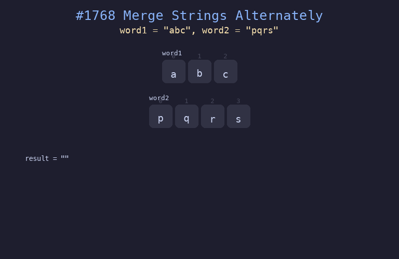

# 1768. 合并交替字符串

## 题目描述
给你两个字符串 `word1` 和 `word2`。请你从 `word1` 开始，通过交替添加字母来合并字符串。如果一个字符串比另一个字符串长，就将多出来的字母追加到合并后字符串的末尾。

## 解题思路
1. 使用双指针 `i` 和 `j` 分别遍历两个字符串
2. 交替从 `word1` 和 `word2` 取字符加入结果
3. 当一个字符串遍历完后，将另一个字符串剩余部分直接追加

## 代码
```python
def mergeAlternately(word1: str, word2: str) -> str:
    result = []
    i, j = 0, 0
    while i < len(word1) or j < len(word2):
        if i < len(word1):
            result.append(word1[i])
            i += 1
        if j < len(word2):
            result.append(word2[j])
            j += 1
    return "".join(result)
```

## 动画演示


## 复杂度分析
- **时间复杂度**: O(n + m)，其中 n 和 m 分别是两个字符串的长度
- **空间复杂度**: O(n + m)，用于存储结果字符串
