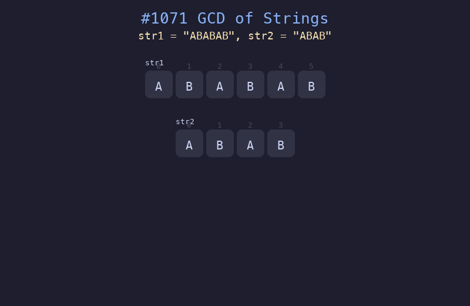

# 1071. 字符串的最大公因子

## 题目描述
对于字符串 `s` 和 `t`，只有在 `s = t + t + ... + t`（`t` 自身连接 1 次或多次）时，我们才认定 `t` 能除尽 `s`。给定两个字符串 `str1` 和 `str2`，返回最大的字符串 `x`，要求 `x` 能除尽 `str1` 且能除尽 `str2`。

## 解题思路
1. 先检查 `str1 + str2 == str2 + str1`，若不等则无公因子
2. 计算两个字符串长度的最大公约数 `g = gcd(len1, len2)`
3. 返回 `str1[:g]` 作为最大公因子字符串

## 代码
```python
from math import gcd

def gcdOfStrings(str1: str, str2: str) -> str:
    if str1 + str2 != str2 + str1:
        return ""
    return str1[:gcd(len(str1), len(str2))]
```

## 动画演示


## 复杂度分析
- **时间复杂度**: O(n + m)，其中 n 和 m 分别是两个字符串的长度
- **空间复杂度**: O(n + m)，用于拼接字符串进行比较
