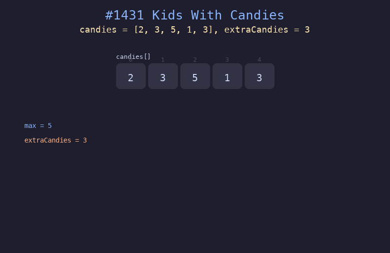

# 1431. 拥有最多糖果的孩子

## 题目描述
给你一个数组 `candies` 和一个整数 `extraCandies`，其中 `candies[i]` 代表第 `i` 个孩子拥有的糖果数目。对每个孩子，检查是否存在一种方案，将额外的 `extraCandies` 个糖果分配给该孩子后，此孩子有最多的糖果。注意，允许有多个孩子同时拥有最多的糖果数目。

## 解题思路
1. 先找到数组中的最大值 `maxCandy`
2. 遍历每个孩子，判断 `candies[i] + extraCandies >= maxCandy`
3. 将判断结果存入布尔数组返回

## 代码
```python
def kidsWithCandies(candies: list[int], extraCandies: int) -> list[bool]:
    max_candy = max(candies)
    return [c + extraCandies >= max_candy for c in candies]
```

## 动画演示


## 复杂度分析
- **时间复杂度**: O(n)，遍历数组两次（找最大值 + 判断）
- **空间复杂度**: O(n)，存储结果数组
