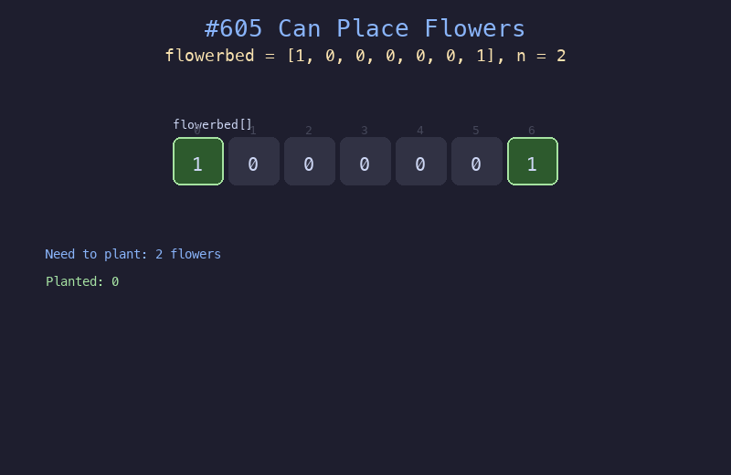

# 605. 种花问题

## 题目描述
假设有一个很长的花坛，一部分地块种植了花，另一部分却没有。可是，花不能种植在相邻的地块上，它们会争夺水源，两者都会死去。给你一个整数数组 `flowerbed` 表示花坛，由若干 0 和 1 组成，其中 0 表示没种植花，1 表示种植了花。另有一个数 `n`，判断能否在不打破种植规则的情况下种入 `n` 朵花。

## 解题思路
1. 从左到右扫描花坛的每个位置
2. 对于每个空位（值为0），检查左右邻居是否也为空
3. 如果可以种花，将该位置设为1，计数器加1
4. 当种够 `n` 朵花时提前返回 `true`

## 代码
```python
def canPlaceFlowers(flowerbed: list[int], n: int) -> bool:
    count = 0
    for i in range(len(flowerbed)):
        if flowerbed[i] == 0:
            empty_left = (i == 0 or flowerbed[i - 1] == 0)
            empty_right = (i == len(flowerbed) - 1 or flowerbed[i + 1] == 0)
            if empty_left and empty_right:
                flowerbed[i] = 1
                count += 1
                if count >= n:
                    return True
    return count >= n
```

## 动画演示


## 复杂度分析
- **时间复杂度**: O(n)，只需遍历一次花坛数组
- **空间复杂度**: O(1)，原地修改数组
