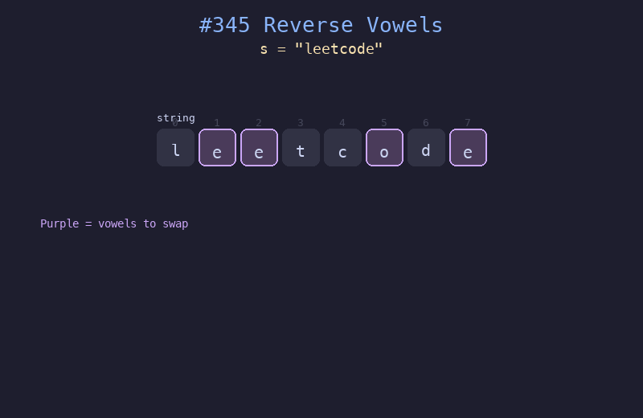

# 345. 反转字符串中的元音字母

## 题目描述
给你一个字符串 `s`，仅反转字符串中的所有元音字母，并返回结果字符串。元音字母包括 `'a'`、`'e'`、`'i'`、`'o'`、`'u'`，且可能以大小写两种形式出现。

## 解题思路
1. 使用双指针，`left` 从左往右，`right` 从右往左
2. 分别移动两个指针直到都指向元音字母
3. 交换两个元音字母，然后继续向中间收缩
4. 当 `left >= right` 时结束

## 代码
```python
def reverseVowels(s: str) -> str:
    vowels = set("aeiouAEIOU")
    chars = list(s)
    left, right = 0, len(chars) - 1
    while left < right:
        while left < right and chars[left] not in vowels:
            left += 1
        while left < right and chars[right] not in vowels:
            right -= 1
        if left < right:
            chars[left], chars[right] = chars[right], chars[left]
            left += 1
            right -= 1
    return "".join(chars)
```

## 动画演示


## 复杂度分析
- **时间复杂度**: O(n)，每个字符最多被访问一次
- **空间复杂度**: O(n)，将字符串转为列表
