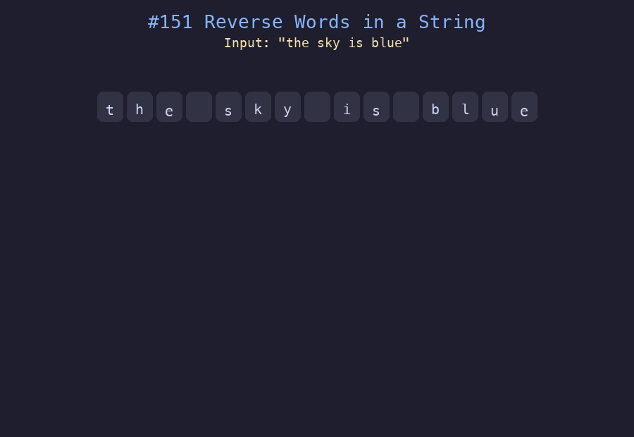

# 151. 反转字符串中的单词

## 题目描述
给你一个字符串 `s`，请你反转字符串中单词的顺序。单词是由非空格字符组成的字符串，`s` 中使用至少一个空格将字符串中的单词分隔开。返回单词顺序颠倒且单词之间用单个空格连接的结果字符串。

## 解题思路
1. 使用 `split()` 将字符串按空格分割为单词数组，自动处理多余空格
2. 将单词数组反转
3. 用单个空格将单词重新拼接

## 代码
```python
def reverseWords(s: str) -> str:
    words = s.split()
    words.reverse()
    return " ".join(words)
```

## 动画演示


## 复杂度分析
- **时间复杂度**: O(n)，其中 n 是字符串长度
- **空间复杂度**: O(n)，用于存储分割后的单词数组
