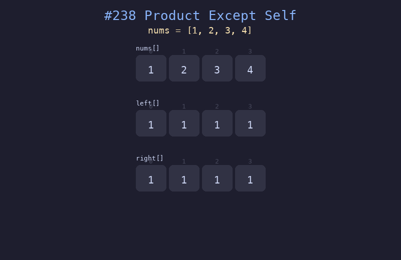

# 238. 除自身以外数组的乘积

## 题目描述
给你一个整数数组 `nums`，返回数组 `answer`，其中 `answer[i]` 等于 `nums` 中除 `nums[i]` 之外其余各元素的乘积。题目保证 `nums` 中任意元素的全部前缀元素和后缀的乘积都在 32 位整数范围内。请不要使用除法。

## 解题思路
1. 构建左乘积数组 `left[]`：`left[i]` 为 `nums[0..i-1]` 的乘积
2. 构建右乘积数组 `right[]`：`right[i]` 为 `nums[i+1..n-1]` 的乘积
3. 最终结果 `result[i] = left[i] * right[i]`

## 代码
```python
def productExceptSelf(nums: list[int]) -> list[int]:
    n = len(nums)
    result = [1] * n
    # Left pass
    left = 1
    for i in range(n):
        result[i] = left
        left *= nums[i]
    # Right pass
    right = 1
    for i in range(n - 1, -1, -1):
        result[i] *= right
        right *= nums[i]
    return result
```

## 动画演示


## 复杂度分析
- **时间复杂度**: O(n)，两次遍历数组
- **空间复杂度**: O(1)，除输出数组外不使用额外空间（优化版本）
