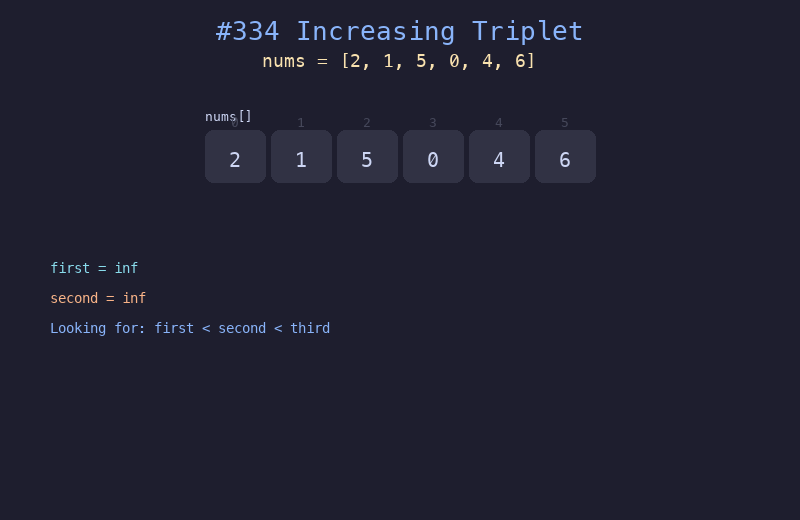

# 334. 递增的三元子序列

## 题目描述
给你一个整数数组 `nums`，判断这个数组中是否存在长度为 3 的递增子序列。如果存在这样的三元组下标 `(i, j, k)` 且满足 `i < j < k`，使得 `nums[i] < nums[j] < nums[k]`，返回 `true`；否则返回 `false`。

## 解题思路
1. 维护两个变量 `first` 和 `second`，分别表示当前最小值和次小值
2. 遍历数组，对于每个元素：
   - 如果 `<= first`，更新 `first`
   - 如果 `<= second`，更新 `second`
   - 否则找到了第三个递增元素，返回 `true`
3. 遍历结束未找到则返回 `false`

## 代码
```python
def increasingTriplet(nums: list[int]) -> bool:
    first = second = float('inf')
    for num in nums:
        if num <= first:
            first = num
        elif num <= second:
            second = num
        else:
            return True
    return False
```

## 动画演示


## 复杂度分析
- **时间复杂度**: O(n)，只需遍历一次数组
- **空间复杂度**: O(1)，只使用两个变量
