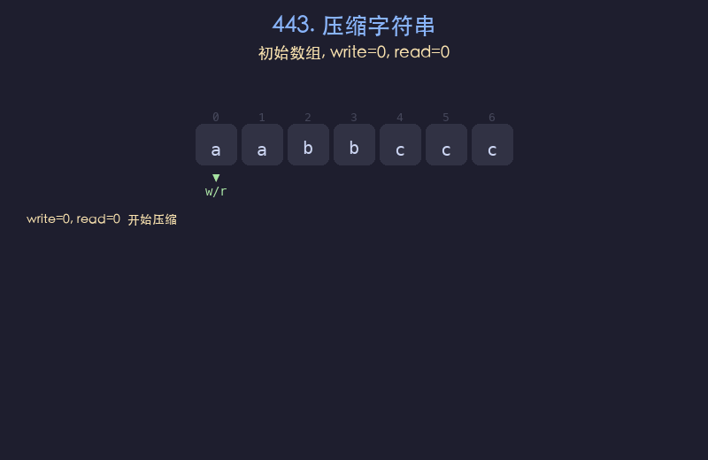

# 443. 压缩字符串

## 题目描述
给你一个字符数组 `chars`，请使用下述算法压缩：从一个空字符串 `s` 开始处理。对于 `chars` 中的每组连续重复字符，如果该组长度为 1，则将字符追加到 `s` 中；否则追加字符后跟该组长度。压缩后的字符串不应该直接返回，而是存储在输入数组 `chars` 中。返回压缩后数组的新长度。

## 解题思路
1. 使用双指针：读指针 `read` 遍历原数组，写指针 `write` 记录写入位置
2. 对每组连续相同字符，统计出现次数
3. 先写入字符本身，若计数大于 1，再将计数的每一位数字依次写入
4. 最终 `write` 的值即为压缩后的数组长度

## 代码
```python
def compress(chars):
    write = 0
    read = 0
    n = len(chars)
    while read < n:
        ch = chars[read]
        count = 0
        while read < n and chars[read] == ch:
            count += 1
            read += 1
        chars[write] = ch
        write += 1
        if count > 1:
            for d in str(count):
                chars[write] = d
                write += 1
    return write
```

## 动画演示


## 复杂度分析
- **时间复杂度**: O(n)，其中 n 为数组长度，每个字符最多被读写各一次
- **空间复杂度**: O(1)，原地修改，只使用常数额外空间
