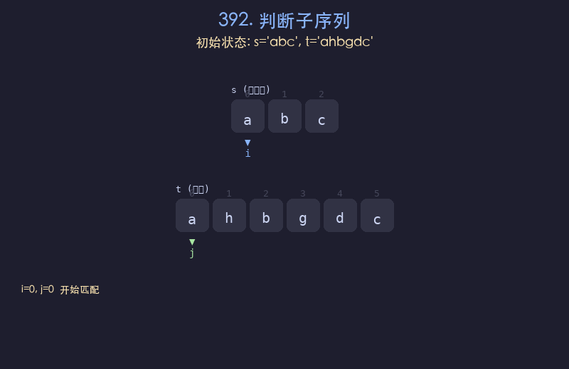

# 392. 判断子序列

## 题目描述
给定字符串 `s` 和 `t`，判断 `s` 是否为 `t` 的子序列。字符串的一个子序列是原始字符串删除一些（也可以不删除）字符而不改变剩余字符相对位置形成的新字符串。

## 解题思路
1. 使用双指针：`i` 指向 `s`，`j` 指向 `t`
2. 如果 `s[i] == t[j]`，说明匹配成功，两个指针同时前进
3. 如果不匹配，只移动 `j`，继续在 `t` 中寻找下一个匹配字符
4. 当 `i` 到达 `s` 末尾时，说明 `s` 是 `t` 的子序列

## 代码
```python
def isSubsequence(s, t):
    i, j = 0, 0
    while i < len(s) and j < len(t):
        if s[i] == t[j]:
            i += 1
        j += 1
    return i == len(s)
```

## 动画演示


## 复杂度分析
- **时间复杂度**: O(n)，其中 n 为 t 的长度
- **空间复杂度**: O(1)，只使用常数额外空间
