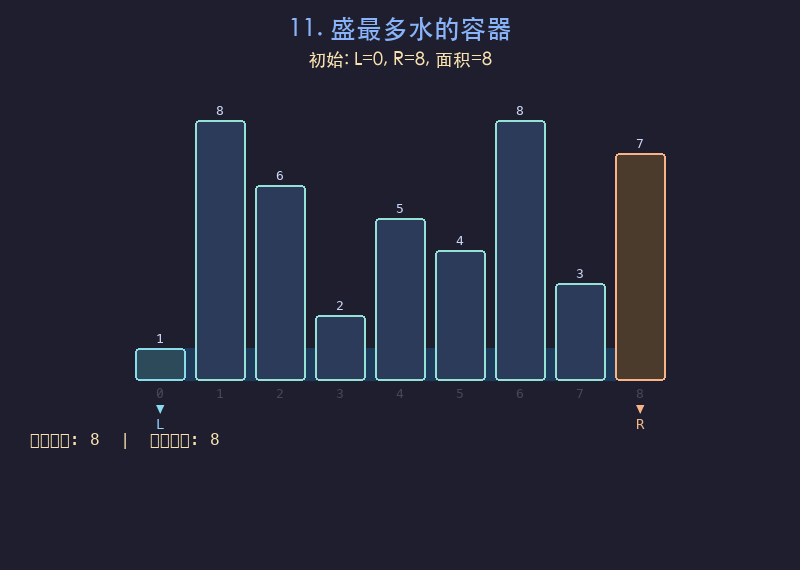

# 11. 盛最多水的容器

## 题目描述
给定一个长度为 `n` 的整数数组 `height`，其中 `height[i]` 表示第 `i` 条线的高度。找出其中的两条线，使得它们与 x 轴共同构成的容器可以容纳最多的水。返回容器可以储存的最大水量。

## 解题思路
1. 使用左右双指针：`left` 从最左端开始，`right` 从最右端开始
2. 每次计算当前两根柱子围成的面积 = min(height[left], height[right]) * (right - left)
3. 移动较短的那根柱子对应的指针（因为移动较长的不可能增大面积）
4. 持续更新最大面积直到两指针相遇

## 代码
```python
def maxArea(height):
    left, right = 0, len(height) - 1
    max_area = 0
    while left < right:
        area = min(height[left], height[right]) * (right - left)
        max_area = max(max_area, area)
        if height[left] < height[right]:
            left += 1
        else:
            right -= 1
    return max_area
```

## 动画演示


## 复杂度分析
- **时间复杂度**: O(n)，双指针最多遍历一次数组
- **空间复杂度**: O(1)，只使用常数额外空间
