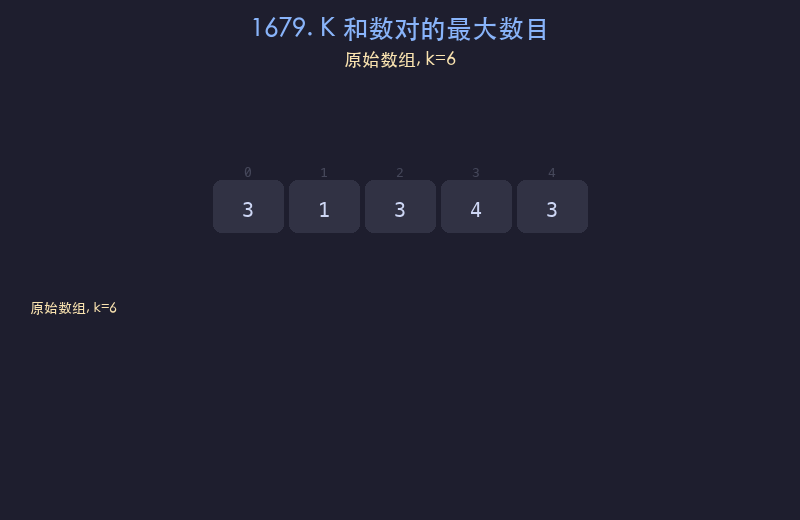

# 1679. K 和数对的最大数目

## 题目描述
给你一个整数数组 `nums` 和一个整数 `k`。每一步操作中，你需要从数组中选出和为 `k` 的两个整数，并将它们移出数组。返回你可以对数组执行的最大操作数。

## 解题思路
1. 先将数组排序
2. 使用左右双指针：`left` 从最左端，`right` 从最右端
3. 若 `nums[left] + nums[right] == k`，找到一对，两指针同时收缩，计数加一
4. 若和小于 `k`，左指针右移以增大和；若和大于 `k`，右指针左移以减小和

## 代码
```python
def maxOperations(nums, k):
    nums.sort()
    left, right = 0, len(nums) - 1
    count = 0
    while left < right:
        s = nums[left] + nums[right]
        if s == k:
            count += 1
            left += 1
            right -= 1
        elif s < k:
            left += 1
        else:
            right -= 1
    return count
```

## 动画演示


## 复杂度分析
- **时间复杂度**: O(n log n)，排序占主导
- **空间复杂度**: O(1)，不计排序的栈空间
