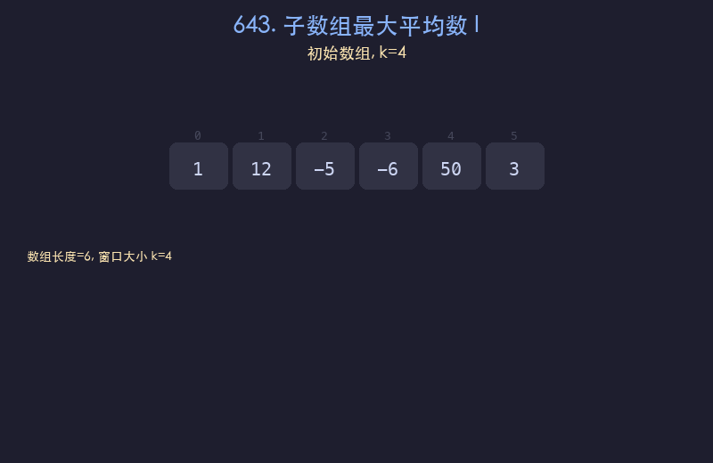

# 643. 子数组最大平均数 I

## 题目描述
给你一个由 `n` 个元素组成的整数数组 `nums` 和一个整数 `k`。请你找出平均数最大且长度为 `k` 的连续子数组，并输出该最大平均数。

## 解题思路
1. 先计算前 `k` 个元素的窗口和作为初始值
2. 滑动窗口每次右移一位：加入右边新元素，减去左边离开的元素
3. 每次滑动后更新最大窗口和
4. 最终最大平均数 = 最大窗口和 / k

## 代码
```python
def findMaxAverage(nums, k):
    window_sum = sum(nums[:k])
    max_sum = window_sum
    for i in range(k, len(nums)):
        window_sum += nums[i] - nums[i - k]
        max_sum = max(max_sum, window_sum)
    return max_sum / k
```

## 动画演示


## 复杂度分析
- **时间复杂度**: O(n)，其中 n 为数组长度，只需一次遍历
- **空间复杂度**: O(1)，只使用常数额外空间
