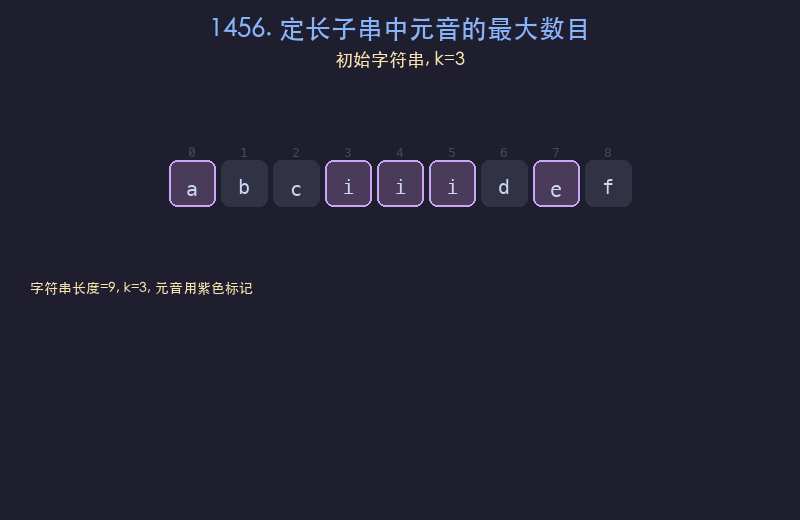

# 1456. 定长子串中元音的最大数目

## 题目描述
给你字符串 `s` 和整数 `k`。请返回字符串 `s` 中长度为 `k` 的单个子字符串中可能包含的最大元音字母数。英文中的元音字母为 `a`、`e`、`i`、`o`、`u`。

## 解题思路
1. 使用定长滑动窗口，窗口大小固定为 `k`
2. 先统计前 `k` 个字符中的元音数量作为初始值
3. 窗口每次右移一位：若移出字符是元音则减一，移入字符是元音则加一
4. 每次滑动后更新最大元音数

## 代码
```python
def maxVowels(s, k):
    vowels = set("aeiou")
    count = sum(1 for ch in s[:k] if ch in vowels)
    max_count = count
    for i in range(k, len(s)):
        if s[i] in vowels:
            count += 1
        if s[i - k] in vowels:
            count -= 1
        max_count = max(max_count, count)
    return max_count
```

## 动画演示


## 复杂度分析
- **时间复杂度**: O(n)，其中 n 为字符串长度
- **空间复杂度**: O(1)，只使用常数额外空间
