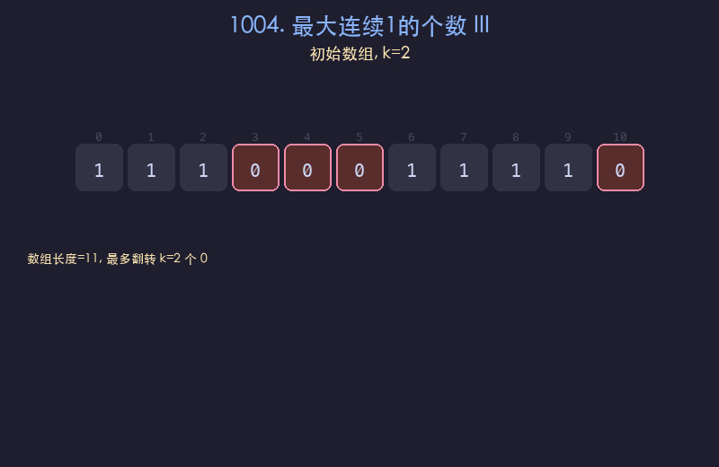

# 1004. 最大连续1的个数 III

## 题目描述
给定一个二进制数组 `nums` 和一个整数 `k`，如果可以翻转最多 `k` 个 `0`，则返回数组中连续 `1` 的最大个数。

## 解题思路
1. 使用可变大小的滑动窗口，维护窗口内 0 的个数
2. 右指针每次右移一位扩展窗口，若遇到 0 则计数加一
3. 当窗口内 0 的个数超过 k 时，左指针右移收缩窗口，直到 0 的数量不超过 k
4. 每次更新窗口的最大长度

## 代码
```python
def longestOnes(nums, k):
    left = 0
    zeros = 0
    max_len = 0
    for right in range(len(nums)):
        if nums[right] == 0:
            zeros += 1
        while zeros > k:
            if nums[left] == 0:
                zeros -= 1
            left += 1
        max_len = max(max_len, right - left + 1)
    return max_len
```

## 动画演示


## 复杂度分析
- **时间复杂度**: O(n)，左右指针各最多移动 n 次
- **空间复杂度**: O(1)，只使用常数额外空间
