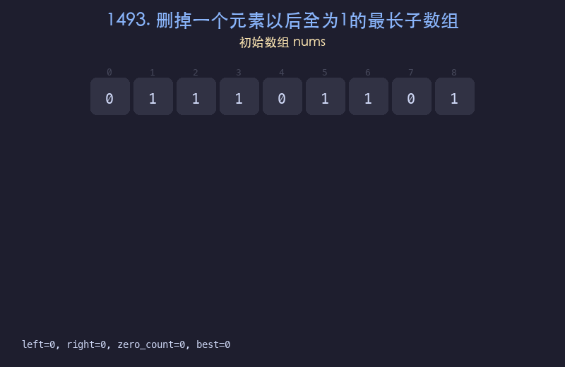

# 1493. 删掉一个元素以后全为1的最长子数组

## 题目描述
给你一个二进制数组 `nums`，你需要从中删掉一个元素。请你在删掉一个元素的情况下，返回最长的且只包含 1 的非空子数组的长度。如果不存在这样的子数组，请返回 0。

## 解题思路
1. 使用滑动窗口，维护窗口内最多包含一个 0
2. 右指针向右扩展，遇到 0 时计数加一
3. 当窗口内 0 的个数超过 1 时，左指针右移缩小窗口
4. 窗口长度减 1（删除的那个元素）即为当前候选答案

## 代码
```python
def longestSubarray(nums):
    left = 0
    zero_count = 0
    best = 0
    for right in range(len(nums)):
        if nums[right] == 0:
            zero_count += 1
        while zero_count > 1:
            if nums[left] == 0:
                zero_count -= 1
            left += 1
        best = max(best, right - left + 1 - 1)
    return best
```

## 动画演示


## 复杂度分析
- **时间复杂度**: O(n)，每个元素最多被访问两次
- **空间复杂度**: O(1)，只使用常数额外空间
