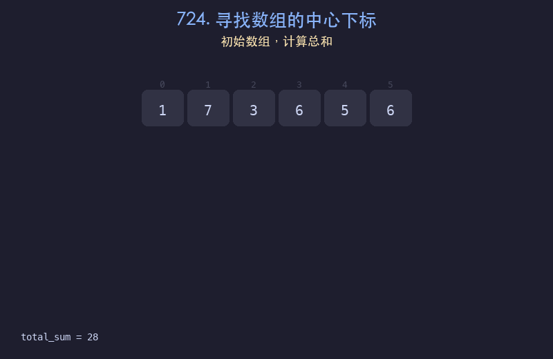

# 724. 寻找数组的中心下标

## 题目描述
给你一个整数数组 `nums`，请计算数组的中心下标。数组的中心下标是数组的一个下标，其左侧所有元素相加的和等于右侧所有元素相加的和。如果中心下标位于数组最左端，那么左侧数之和视为 0。返回最靠近左边的中心下标，如果不存在则返回 -1。

## 解题思路
1. 先计算数组总和 total_sum
2. 从左到右遍历，维护 left_sum
3. 对于每个位置 i，right_sum = total_sum - left_sum - nums[i]
4. 当 left_sum == right_sum 时，i 就是中心下标

## 代码
```python
def pivotIndex(nums):
    total = sum(nums)
    left_sum = 0
    for i in range(len(nums)):
        right_sum = total - left_sum - nums[i]
        if left_sum == right_sum:
            return i
        left_sum += nums[i]
    return -1
```

## 动画演示


## 复杂度分析
- **时间复杂度**: O(n)，遍历一次数组
- **空间复杂度**: O(1)，只使用常数额外空间
