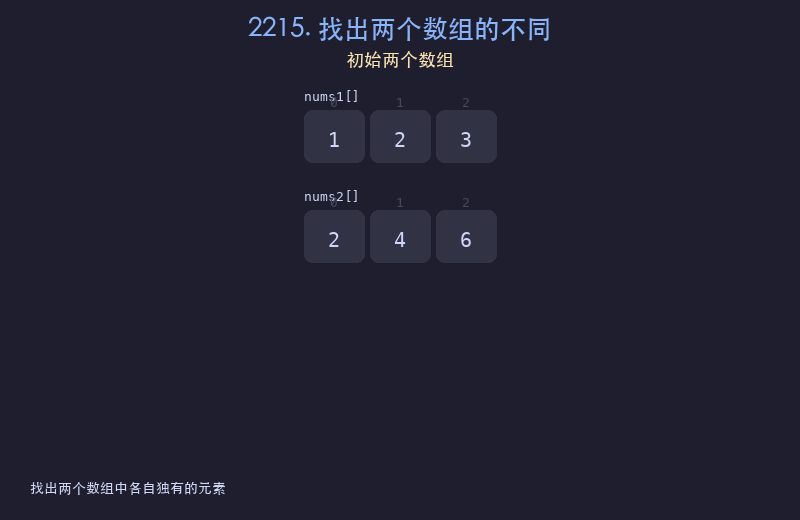

# 2215. 找出两个数组的不同

## 题目描述
给你两个下标从 0 开始的整数数组 `nums1` 和 `nums2`，请你返回一个长度为 2 的列表 `answer`，其中 `answer[0]` 是 `nums1` 中所有不存在于 `nums2` 中的不同整数组成的列表，`answer[1]` 是 `nums2` 中所有不存在于 `nums1` 中的不同整数组成的列表。

## 解题思路
1. 将 nums1 和 nums2 分别转换为集合 set1 和 set2
2. 用集合差集运算找出 set1 中不在 set2 中的元素
3. 同理找出 set2 中不在 set1 中的元素

## 代码
```python
def findDifference(nums1, nums2):
    set1, set2 = set(nums1), set(nums2)
    return [list(set1 - set2), list(set2 - set1)]
```

## 动画演示


## 复杂度分析
- **时间复杂度**: O(n + m)，n 和 m 分别是两个数组的长度
- **空间复杂度**: O(n + m)，存储两个集合
