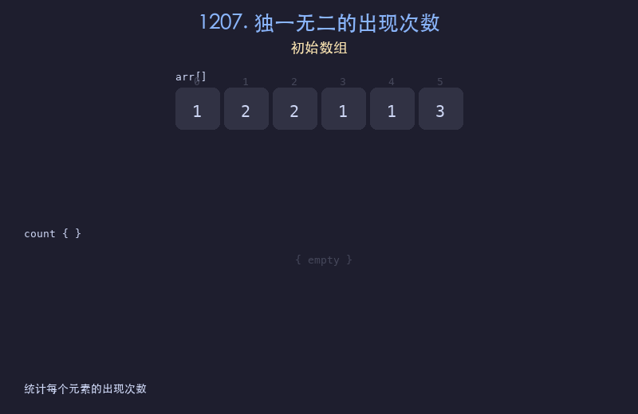

# 1207. 独一无二的出现次数

## 题目描述
给你一个整数数组 `arr`，请你帮忙统计数组中每个数的出现次数。如果每个数的出现次数都是独一无二的，就返回 `true`；否则返回 `false`。

## 解题思路
1. 使用哈希表统计每个元素的出现次数
2. 将所有出现次数放入一个集合中
3. 如果集合大小等于哈希表大小，说明每个出现次数都是唯一的

## 代码
```python
def uniqueOccurrences(arr):
    count = {}
    for val in arr:
        count[val] = count.get(val, 0) + 1
    freqs = list(count.values())
    return len(freqs) == len(set(freqs))
```

## 动画演示


## 复杂度分析
- **时间复杂度**: O(n)，遍历数组统计频率
- **空间复杂度**: O(n)，存储哈希表和集合
