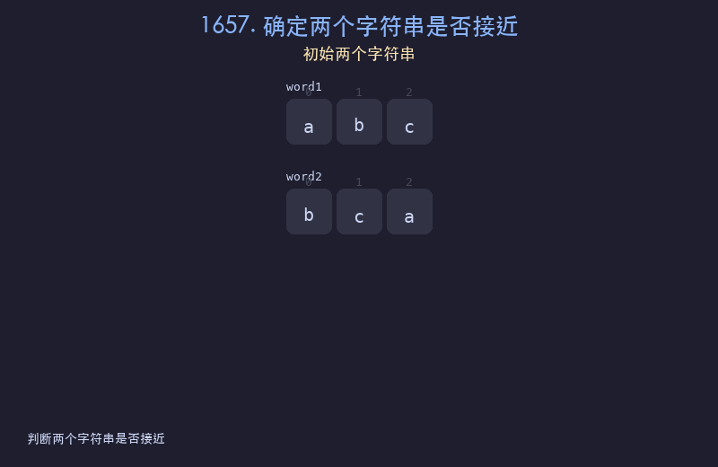

# 1657. 确定两个字符串是否接近

## 题目描述
如果可以使用以下操作从一个字符串得到另一个字符串，则认为两个字符串接近：操作 1：交换任意两个现有字符；操作 2：将一个现有字符的每次出现转换为另一个现有字符，并对另一个字符执行相同的操作。给你两个字符串 `word1` 和 `word2`，如果它们接近则返回 `true`，否则返回 `false`。

## 解题思路
1. 两个字符串接近的充要条件：包含相同的字符种类，且字符频率排序后相同
2. 操作 1 可以任意重排字符顺序
3. 操作 2 可以交换两个字符的出现次数
4. 因此只需检查字符集是否相同、频率排序是否相同

## 代码
```python
from collections import Counter

def closeStrings(word1, word2):
    c1, c2 = Counter(word1), Counter(word2)
    return (set(c1.keys()) == set(c2.keys()) and
            sorted(c1.values()) == sorted(c2.values()))
```

## 动画演示


## 复杂度分析
- **时间复杂度**: O(n)，统计频率为 O(n)，排序频率为 O(26 log 26) = O(1)
- **空间复杂度**: O(1)，最多 26 个字母
