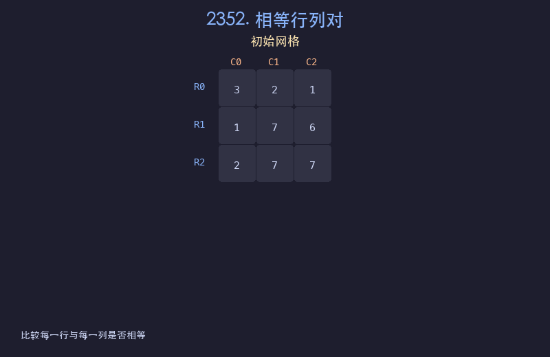

# 2352. 相等行列对

## 题目描述
给你一个下标从 0 开始、大小为 `n x n` 的整数矩阵 `grid`，返回满足 `Ri` 行和 `Cj` 列相等的行列对 `(Ri, Cj)` 的数目。如果行和列以相同的顺序包含相同的元素（即相等的数组），则认为二者是相等的。

## 解题思路
1. 遍历每一对行和列的组合 (r, c)
2. 将第 r 行的元素与第 c 列的元素逐一比较
3. 如果完全相同则计数加一
4. 也可以用哈希表优化：将每行转为元组存入哈希表，再逐列查找

## 代码
```python
def equalPairs(grid):
    n = len(grid)
    count = 0
    for r in range(n):
        for c in range(n):
            col = [grid[i][c] for i in range(n)]
            if grid[r] == col:
                count += 1
    return count
```

## 动画演示


## 复杂度分析
- **时间复杂度**: O(n^3)，枚举 n^2 对行列，每对比较 n 个元素
- **空间复杂度**: O(n)，提取列时需要 O(n) 空间
