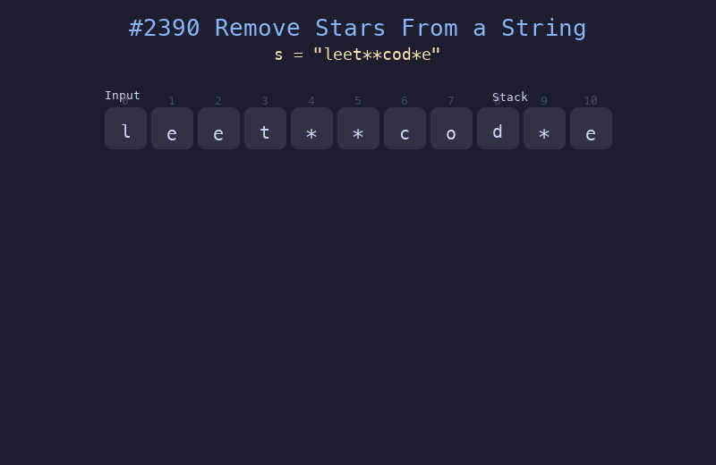

# 2390. 从字符串中移除星号

## 题目描述
给你一个包含若干星号 `*` 的字符串 `s`。每次操作，你可以选中 `s` 中最靠近星号左侧的非星号字符，移除该字符和星号。返回移除所有星号之后的字符串。

## 解题思路
1. 使用栈来模拟操作过程
2. 遍历字符串，遇到普通字符则入栈
3. 遇到星号 `*` 则弹出栈顶元素（即最近的非星号字符）
4. 最终栈中剩余的字符从底到顶拼接即为结果

## 代码
```python
def removeStars(s: str) -> str:
    stack = []
    for ch in s:
        if ch == '*':
            stack.pop()
        else:
            stack.append(ch)
    return ''.join(stack)
```

## 动画演示


## 复杂度分析
- **时间复杂度**: O(n)，其中 n 为字符串长度，每个字符最多入栈和出栈各一次
- **空间复杂度**: O(n)，栈的最大空间
