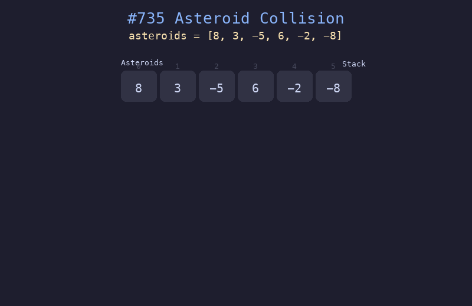

# 735. 行星碰撞

## 题目描述
给定一个整数数组 `asteroids`，表示在同一行的行星。每个元素的绝对值表示行星的大小，正负表示行星的移动方向（正号表示向右移动，负号表示向左移动）。每一颗行星以相同的速度移动。找出碰撞后剩下的所有行星。

## 解题思路
1. 使用栈来模拟碰撞过程
2. 遍历每颗行星，若向右移动（正数）则直接入栈
3. 若向左移动（负数），与栈顶向右的行星比较大小进行碰撞
4. 碰撞时，较小的行星被摧毁；大小相等则两颗都被摧毁；较大的存活

## 代码
```python
def asteroidCollision(asteroids: list[int]) -> list[int]:
    stack = []
    for ast in asteroids:
        alive = True
        while alive and ast < 0 and stack and stack[-1] > 0:
            if stack[-1] < -ast:
                stack.pop()
            elif stack[-1] == -ast:
                stack.pop()
                alive = False
            else:
                alive = False
        if alive:
            stack.append(ast)
    return stack
```

## 动画演示


## 复杂度分析
- **时间复杂度**: O(n)，每个行星最多入栈出栈各一次
- **空间复杂度**: O(n)，栈的最大空间
