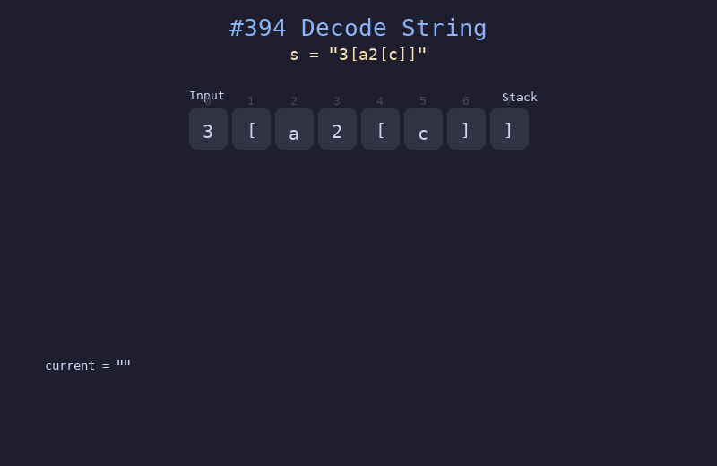

# 394. 字符串解码

## 题目描述
给定一个经过编码的字符串，返回它解码后的字符串。编码规则为 `k[encoded_string]`，表示其中方括号内部的 `encoded_string` 正好重复 `k` 次。

## 解题思路
1. 使用栈保存之前的字符串和重复次数
2. 遇到数字时累积当前数字
3. 遇到 `[` 时，将当前字符串和数字压入栈，重置当前字符串
4. 遇到 `]` 时，弹出栈顶，将当前字符串重复指定次数并拼接到之前的字符串后
5. 遇到字母时，追加到当前字符串

## 代码
```python
def decodeString(s: str) -> str:
    stack = []
    cur_str = ""
    cur_num = 0
    for ch in s:
        if ch.isdigit():
            cur_num = cur_num * 10 + int(ch)
        elif ch == '[':
            stack.append((cur_str, cur_num))
            cur_str, cur_num = "", 0
        elif ch == ']':
            prev_str, num = stack.pop()
            cur_str = prev_str + cur_str * num
        else:
            cur_str += ch
    return cur_str
```

## 动画演示


## 复杂度分析
- **时间复杂度**: O(n * max_k)，n 为解码后字符串长度
- **空间复杂度**: O(n)，栈的深度和字符串存储
