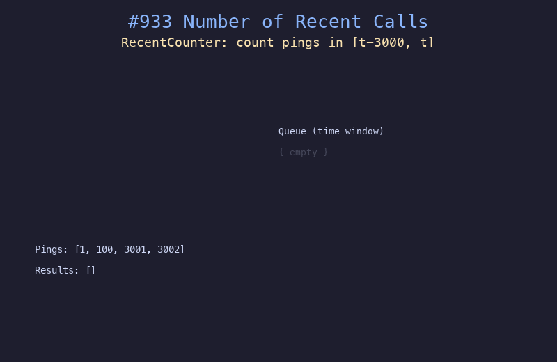

# 933. 最近的请求次数

## 题目描述
写一个 `RecentCounter` 类来计算特定时间范围内最近的请求。每次调用 `ping(t)` 时，返回在 `[t - 3000, t]` 时间范围内的请求数（包括新请求）。保证每次 `ping` 的值严格递增。

## 解题思路
1. 使用队列维护时间窗口内的请求
2. 每次 `ping(t)` 将时间 `t` 加入队列尾部
3. 将队列头部所有早于 `t - 3000` 的时间移除
4. 返回队列的长度即为有效请求数

## 代码
```python
from collections import deque

class RecentCounter:
    def __init__(self):
        self.queue = deque()

    def ping(self, t: int) -> int:
        self.queue.append(t)
        while self.queue[0] < t - 3000:
            self.queue.popleft()
        return len(self.queue)
```

## 动画演示


## 复杂度分析
- **时间复杂度**: 均摊 O(1)，每个元素最多入队出队各一次
- **空间复杂度**: O(n)，队列中最多存储 3000 个时间范围内的请求
