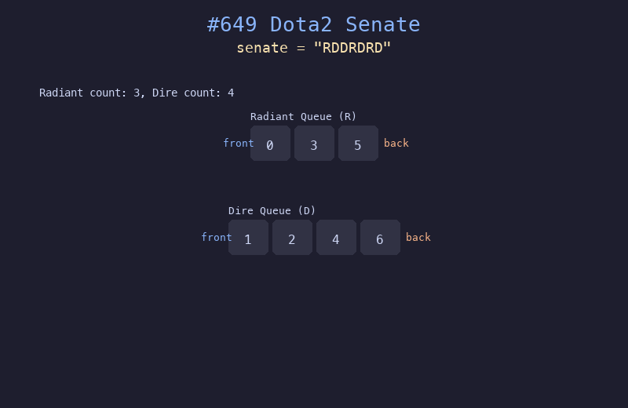

# 649. Dota2 参议院

## 题目描述
Dota2 参议院由 Radiant（天辉）和 Dire（夜魇）两个阵营组成。每位参议员可以行使两种权利：禁止另一个阵营的一名参议员的权利，或宣布胜利（当所有对方阵营的参议员都被禁止时）。给定参议院的阵营顺序，判断哪个阵营最终获胜。

## 解题思路
1. 将 Radiant 和 Dire 参议员的索引分别放入两个队列
2. 每轮比较两个队列队首的索引，索引较小的先行动
3. 先行动的参议员禁止对方，并以 `index + n` 重新入队（模拟下一轮）
4. 当某一方队列为空时，另一方获胜

## 代码
```python
from collections import deque

def predictPartyVictory(senate: str) -> str:
    n = len(senate)
    radiant = deque()
    dire = deque()
    for i, ch in enumerate(senate):
        if ch == 'R':
            radiant.append(i)
        else:
            dire.append(i)
    while radiant and dire:
        r, d = radiant.popleft(), dire.popleft()
        if r < d:
            radiant.append(r + n)
        else:
            dire.append(d + n)
    return "Radiant" if radiant else "Dire"
```

## 动画演示


## 复杂度分析
- **时间复杂度**: O(n)，每位参议员最多被处理常数次
- **空间复杂度**: O(n)，两个队列的空间
