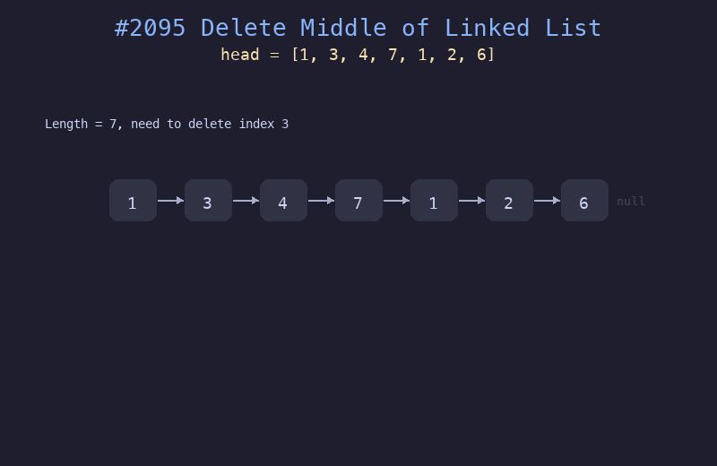

# 2095. 删除链表的中间节点

## 题目描述
给你一个链表的头节点 `head`，删除链表的中间节点，并返回修改后的链表的头节点。中间节点定义为从头节点开始到达链表末尾的中间节点（下标从 0 开始，第 `n/2` 个节点）。

## 解题思路
1. 使用快慢指针找到中间节点
2. 慢指针每次走一步，快指针每次走两步
3. 当快指针到达末尾时，慢指针正好在中间节点
4. 记录慢指针的前驱节点，将其 next 指向慢指针的下一个节点即可删除中间节点

## 代码
```python
def deleteMiddle(head):
    if not head.next:
        return None
    slow, fast = head, head.next.next
    while fast and fast.next:
        slow = slow.next
        fast = fast.next.next
    slow.next = slow.next.next
    return head
```

## 动画演示


## 复杂度分析
- **时间复杂度**: O(n)，快慢指针遍历链表一次
- **空间复杂度**: O(1)，只使用常数额外空间
