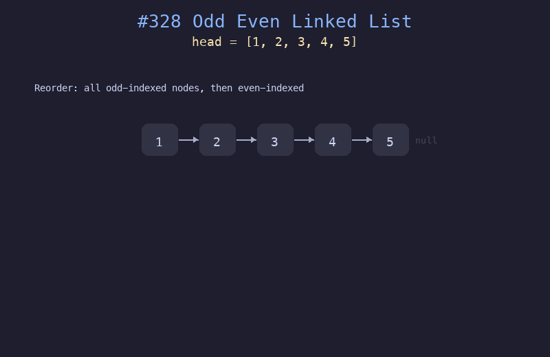

# 328. 奇偶链表

## 题目描述
给定单链表的头节点 `head`，将所有索引为奇数的节点和索引为偶数的节点分别组合在一起，然后返回重新排列的链表。第一个节点的索引被认为是奇数，第二个节点的索引被认为是偶数，以此类推。

## 解题思路
1. 使用两个指针 `odd` 和 `even` 分别跟踪奇数和偶数位置的节点
2. `odd` 指针跳过偶数节点连接下一个奇数节点
3. `even` 指针跳过奇数节点连接下一个偶数节点
4. 最后将奇数链表的尾部连接到偶数链表的头部

## 代码
```python
def oddEvenList(head):
    if not head:
        return head
    odd = head
    even = head.next
    even_head = even
    while even and even.next:
        odd.next = even.next
        odd = odd.next
        even.next = odd.next
        even = even.next
    odd.next = even_head
    return head
```

## 动画演示


## 复杂度分析
- **时间复杂度**: O(n)，遍历链表一次
- **空间复杂度**: O(1)，原地重排，只使用常数额外空间
