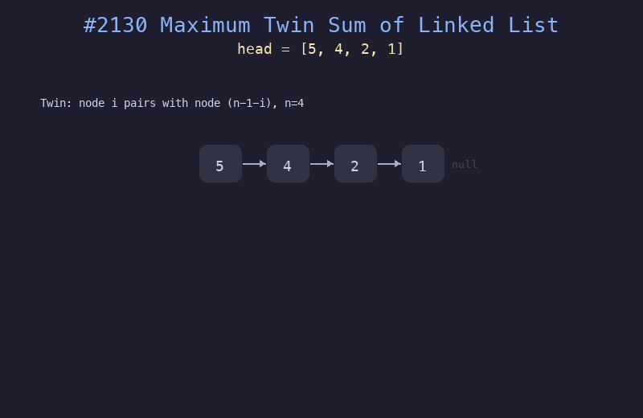

# 2130. 链表最大孪生和

## 题目描述
给你一个偶数长度的链表的头节点 `head`。链表中第 `i` 个节点（从 0 开始）的孪生节点为第 `(n-1-i)` 个节点。孪生和定义为一个节点和它的孪生节点的值之和。返回链表的最大孪生和。

## 解题思路
1. 使用快慢指针找到链表中点
2. 反转链表的后半部分
3. 用两个指针分别从前半部分头部和反转后的后半部分头部开始遍历
4. 计算每对孪生节点的和，取最大值

## 代码
```python
def pairSum(head) -> int:
    # Find middle
    slow, fast = head, head
    while fast and fast.next:
        slow = slow.next
        fast = fast.next.next
    # Reverse second half
    prev = None
    curr = slow
    while curr:
        nxt = curr.next
        curr.next = prev
        prev = curr
        curr = nxt
    # Compare twins
    max_sum = 0
    first, second = head, prev
    while second:
        max_sum = max(max_sum, first.val + second.val)
        first = first.next
        second = second.next
    return max_sum
```

## 动画演示


## 复杂度分析
- **时间复杂度**: O(n)，遍历链表常数次
- **空间复杂度**: O(1)，原地反转，只使用常数额外空间
