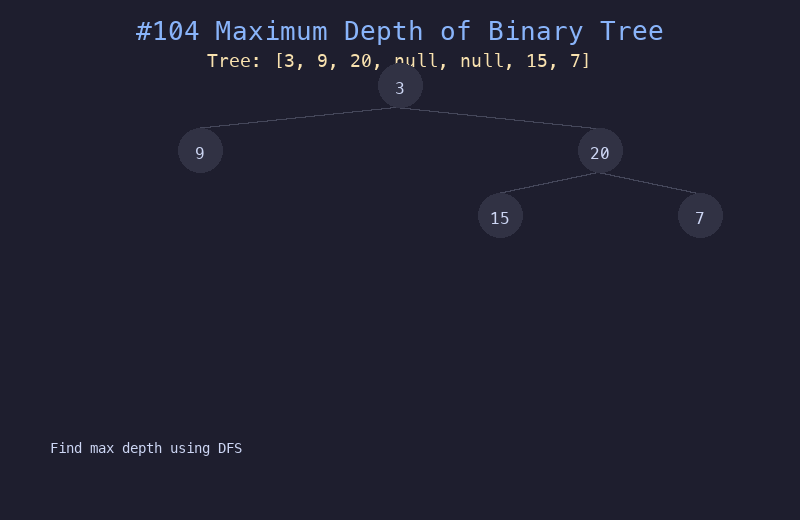

# 104. 二叉树的最大深度

## 题目描述
给定一个二叉树 `root`，返回其最大深度。二叉树的最大深度是指从根节点到最远叶子节点的最长路径上的节点数。

## 解题思路
1. 使用深度优先搜索（DFS）递归遍历二叉树
2. 对每个节点，递归计算左子树和右子树的深度
3. 当前节点的深度 = max(左子树深度, 右子树深度) + 1
4. 空节点返回深度 0

## 代码
```python
def maxDepth(root):
    if not root:
        return 0
    return 1 + max(maxDepth(root.left), maxDepth(root.right))
```

## 动画演示


## 复杂度分析
- **时间复杂度**: O(n)，每个节点访问一次
- **空间复杂度**: O(h)，递归栈深度等于树的高度，最坏 O(n)
