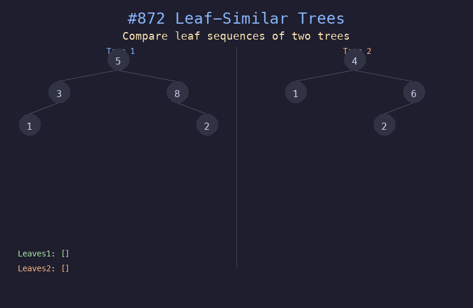

# 872. 叶子相似的树

## 题目描述
如果两棵二叉树的叶值序列相同（从左到右），则认为它们是叶相似的。判断给定的两棵二叉树是否是叶相似的。

## 解题思路
1. 对两棵树分别进行 DFS 遍历，收集叶子节点的值序列
2. 叶子节点的定义：没有左子树也没有右子树的节点
3. DFS 保证按从左到右顺序收集叶子
4. 比较两个叶值序列是否完全相同

## 代码
```python
def leafSimilar(root1, root2):
    def getLeaves(node):
        if not node:
            return []
        if not node.left and not node.right:
            return [node.val]
        return getLeaves(node.left) + getLeaves(node.right)
    return getLeaves(root1) == getLeaves(root2)
```

## 动画演示


## 复杂度分析
- **时间复杂度**: O(n + m)，分别遍历两棵树
- **空间复杂度**: O(n + m)，存储叶值序列和递归栈
