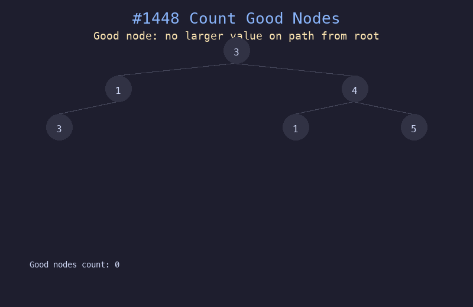

# 1448. 统计二叉树中好节点的数目

## 题目描述
给你一棵根为 `root` 的二叉树，请你返回二叉树中好节点的数目。如果从根到节点 X 的路径上没有任何节点的值大于 X 的值，那么节点 X 就是好节点。

## 解题思路
1. 使用 DFS 遍历，维护从根到当前节点路径上的最大值 `path_max`
2. 如果当前节点值 >= `path_max`，则为好节点，计数加一
3. 更新 `path_max = max(path_max, node.val)` 后继续递归
4. 根节点始终是好节点

## 代码
```python
def goodNodes(root):
    def dfs(node, path_max):
        if not node:
            return 0
        count = 1 if node.val >= path_max else 0
        new_max = max(path_max, node.val)
        count += dfs(node.left, new_max)
        count += dfs(node.right, new_max)
        return count
    return dfs(root, root.val)
```

## 动画演示


## 复杂度分析
- **时间复杂度**: O(n)，每个节点访问一次
- **空间复杂度**: O(h)，递归栈深度等于树的高度
