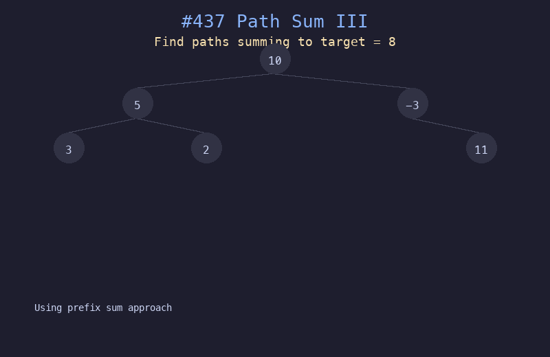

# 437. 路径总和 III

## 题目描述
给定一个二叉树的根节点 `root` 和一个整数 `targetSum`，求该二叉树中值之和等于 `targetSum` 的路径数目。路径不需要从根节点开始，也不需要在叶子节点结束，但路径方向必须是向下的。

## 解题思路
1. 使用前缀和 + 哈希表优化，避免暴力枚举每条路径
2. DFS 遍历时维护从根到当前节点的前缀和 `prefix_sum`
3. 如果 `prefix_sum - target` 存在于哈希表中，说明找到一条路径
4. 回溯时需要将当前前缀和从哈希表中移除

## 代码
```python
from collections import defaultdict

def pathSum(root, targetSum):
    prefix = defaultdict(int)
    prefix[0] = 1

    def dfs(node, curr_sum):
        if not node:
            return 0
        curr_sum += node.val
        count = prefix[curr_sum - targetSum]
        prefix[curr_sum] += 1
        count += dfs(node.left, curr_sum)
        count += dfs(node.right, curr_sum)
        prefix[curr_sum] -= 1
        return count

    return dfs(root, 0)
```

## 动画演示


## 复杂度分析
- **时间复杂度**: O(n)，每个节点访问一次
- **空间复杂度**: O(n)，哈希表和递归栈空间
