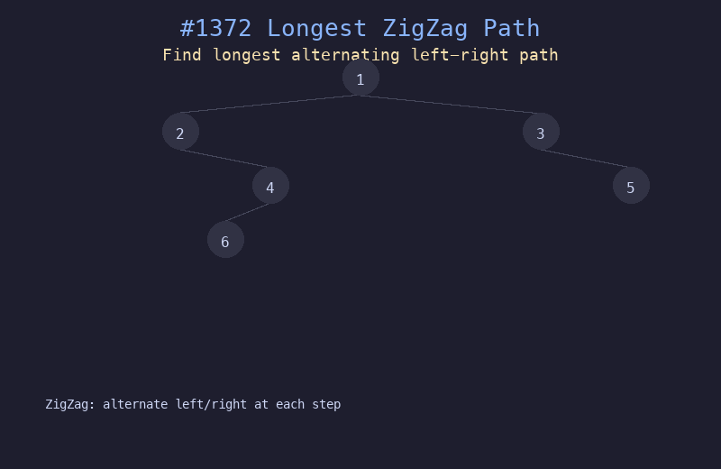

# 1372. 二叉树中的最长交错路径

## 题目描述
给你一棵以 `root` 为根的二叉树，二叉树中的交错路径定义如下：选择一个节点开始，然后交替地向左和向右走。返回二叉树中最长交错路径的长度。

## 解题思路
1. 对每个节点维护两个值：以该节点结尾、最后一步向左走的最长交错长度和最后一步向右走的最长交错长度
2. 如果当前节点是父节点的左孩子，那么交错路径从父节点的"右方向长度+1"继承
3. 如果当前节点是父节点的右孩子，那么交错路径从父节点的"左方向长度+1"继承
4. 每到一个方向不交错时重置为 0 后重新开始

## 代码
```python
def longestZigZag(root):
    result = 0

    def dfs(node):
        nonlocal result
        if not node:
            return -1, -1
        left_left, left_right = dfs(node.left)
        right_left, right_right = dfs(node.right)
        go_left = left_right + 1
        go_right = right_left + 1
        result = max(result, go_left, go_right)
        return go_left, go_right

    dfs(root)
    return result
```

## 动画演示


## 复杂度分析
- **时间复杂度**: O(n)，每个节点访问一次
- **空间复杂度**: O(h)，递归栈深度等于树的高度
