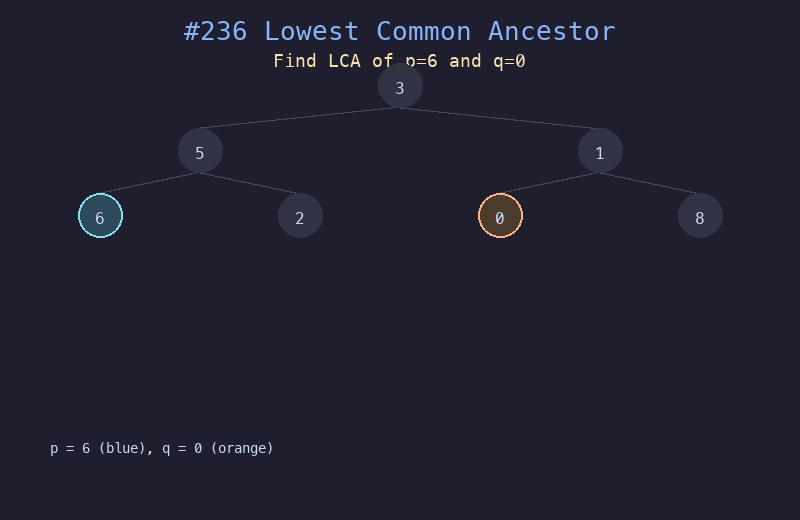

# 236. 二叉树的最近公共祖先

## 题目描述
给定一个二叉树，找到该树中两个指定节点的最近公共祖先（LCA）。最近公共祖先是指两个节点 p 和 q 最近的公共祖先节点，一个节点也可以是它自己的祖先。

## 解题思路
1. 递归遍历二叉树，在左右子树中分别查找 p 和 q
2. 如果当前节点就是 p 或 q，直接返回当前节点
3. 如果左子树和右子树分别找到了 p 和 q，当前节点就是 LCA
4. 如果只有一侧找到，则 LCA 在那一侧的子树中

## 代码
```python
def lowestCommonAncestor(root, p, q):
    if not root or root == p or root == q:
        return root
    left = lowestCommonAncestor(root.left, p, q)
    right = lowestCommonAncestor(root.right, p, q)
    if left and right:
        return root
    return left if left else right
```

## 动画演示


## 复杂度分析
- **时间复杂度**: O(n)，最坏情况下遍历所有节点
- **空间复杂度**: O(h)，递归栈深度等于树的高度
