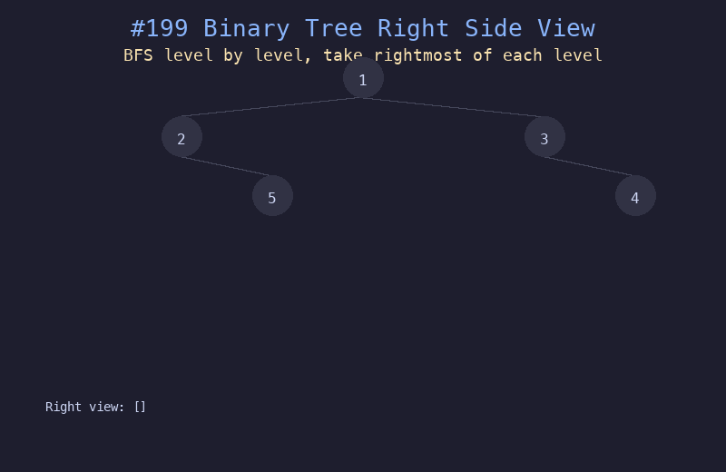

# 199. 二叉树的右视图

## 题目描述
给定一个二叉树的根节点 `root`，想象自己站在它的右侧，按照从顶部到底部的顺序，返回从右侧能看到的节点值。

## 解题思路
1. 使用 BFS（层序遍历），逐层处理节点
2. 每一层从左到右遍历，记录该层最后一个（最右边的）节点值
3. 也可以用 DFS，优先访问右子树，每层第一个访问的就是右视图节点

## 代码
```python
from collections import deque

def rightSideView(root):
    if not root:
        return []
    result = []
    queue = deque([root])
    while queue:
        level_size = len(queue)
        for i in range(level_size):
            node = queue.popleft()
            if i == level_size - 1:
                result.append(node.val)
            if node.left:
                queue.append(node.left)
            if node.right:
                queue.append(node.right)
    return result
```

## 动画演示


## 复杂度分析
- **时间复杂度**: O(n)，每个节点访问一次
- **空间复杂度**: O(w)，队列中最多存储一层的节点，w 为树的最大宽度
