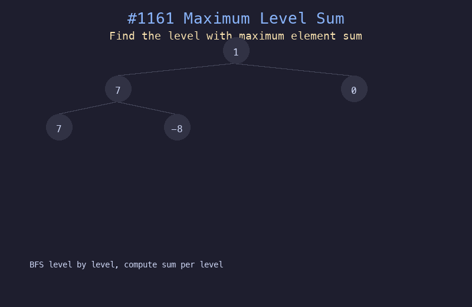

# 1161. 最大层内元素和

## 题目描述
给你一个二叉树的根节点 `root`，请你返回层内元素之和最大的那层的层号。如果有多层的元素和相同，返回层号最小的那层。根节点为第 1 层。

## 解题思路
1. 使用 BFS 层序遍历二叉树
2. 每一层计算所有节点值的总和
3. 维护最大和及其对应的层号
4. 遍历完所有层后返回最大和对应的层号

## 代码
```python
from collections import deque

def maxLevelSum(root):
    max_sum = float('-inf')
    max_level = 1
    level = 1
    queue = deque([root])
    while queue:
        level_sum = 0
        for _ in range(len(queue)):
            node = queue.popleft()
            level_sum += node.val
            if node.left:
                queue.append(node.left)
            if node.right:
                queue.append(node.right)
        if level_sum > max_sum:
            max_sum = level_sum
            max_level = level
        level += 1
    return max_level
```

## 动画演示


## 复杂度分析
- **时间复杂度**: O(n)，每个节点访问一次
- **空间复杂度**: O(w)，队列中最多存储一层的节点数
