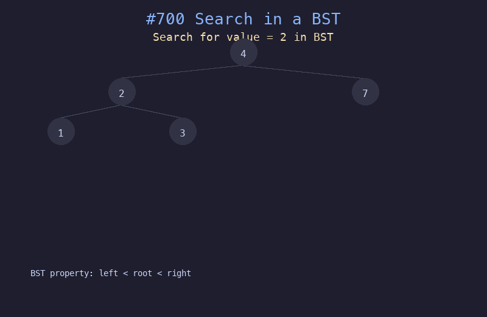

# 700. 二叉搜索树中的搜索

## 题目描述
给定二叉搜索树（BST）的根节点 `root` 和一个整数值 `val`。你需要在 BST 中找到节点值等于 `val` 的节点，返回以该节点为根的子树。如果不存在，返回 `null`。

## 解题思路
1. 利用 BST 性质：左子树所有值 < 根 < 右子树所有值
2. 从根节点开始，比较目标值与当前节点
3. 目标值小于当前节点，搜索左子树
4. 目标值大于当前节点，搜索右子树
5. 相等则找到目标节点

## 代码
```python
def searchBST(root, val):
    if not root or root.val == val:
        return root
    if val < root.val:
        return searchBST(root.left, val)
    return searchBST(root.right, val)
```

## 动画演示


## 复杂度分析
- **时间复杂度**: O(h)，h 为树的高度，平均 O(log n)
- **空间复杂度**: O(h)，递归栈深度
