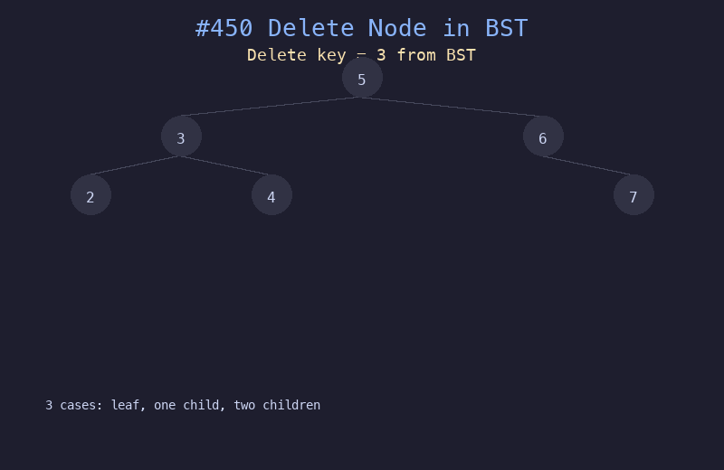

# 450. 删除二叉搜索树中的节点

## 题目描述
给定一个二叉搜索树的根节点 `root` 和一个值 `key`，删除 BST 中值为 `key` 的节点，并保证 BST 性质不变。返回更新后的根节点引用。

## 解题思路
1. 首先在 BST 中搜索目标节点
2. 找到后根据子节点情况分三种处理：
   - **叶子节点**：直接删除
   - **只有一个子节点**：用子节点替换当前节点
   - **有两个子节点**：找到中序后继（右子树最小值），用后继值替换当前值，再删除后继节点
3. 递归处理保持 BST 性质

## 代码
```python
def deleteNode(root, key):
    if not root:
        return None
    if key < root.val:
        root.left = deleteNode(root.left, key)
    elif key > root.val:
        root.right = deleteNode(root.right, key)
    else:
        if not root.left:
            return root.right
        if not root.right:
            return root.left
        # Find inorder successor
        succ = root.right
        while succ.left:
            succ = succ.left
        root.val = succ.val
        root.right = deleteNode(root.right, succ.val)
    return root
```

## 动画演示


## 复杂度分析
- **时间复杂度**: O(h)，h 为树的高度
- **空间复杂度**: O(h)，递归栈深度
