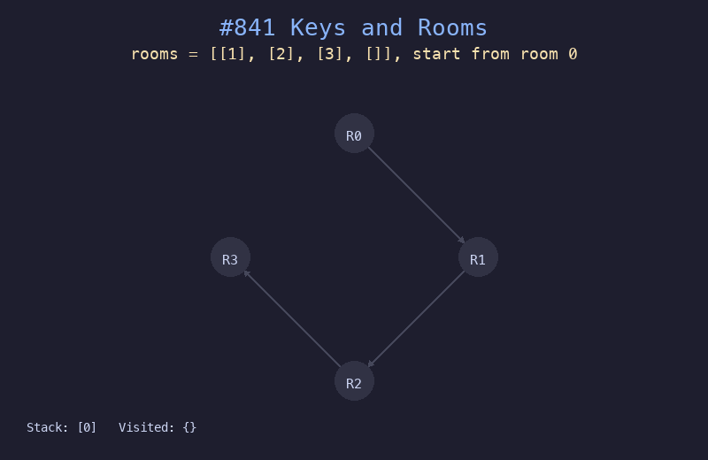

# 841. 钥匙和房间

## 题目描述
有 `n` 个房间，编号从 `0` 到 `n-1`，除 `0` 号房间外其余均被锁上。你从 `0` 号房间开始，每个房间里有若干把钥匙，判断是否能进入所有房间。

## 解题思路
1. 从房间 0 开始进行深度优先搜索 (DFS)
2. 每访问一个房间，收集其中的钥匙并尝试打开对应房间
3. 用 visited 集合记录已访问房间，最终判断是否访问了所有房间

## 代码
```python
def canVisitAllRooms(rooms: list[list[int]]) -> bool:
    visited = set()
    stack = [0]
    while stack:
        room = stack.pop()
        if room in visited:
            continue
        visited.add(room)
        for key in rooms[room]:
            if key not in visited:
                stack.append(key)
    return len(visited) == len(rooms)
```

## 动画演示


## 复杂度分析
- **时间复杂度**: O(n + e)，其中 n 是房间数，e 是钥匙总数
- **空间复杂度**: O(n)，用于存储 visited 集合和栈
