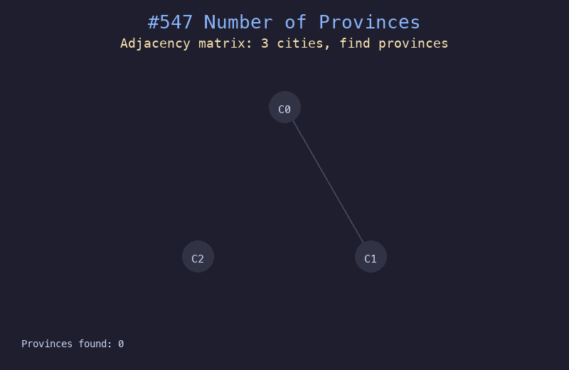

# 547. 省份数量

## 题目描述
有 `n` 个城市，其中一些彼此相连。如果城市 `a` 与城市 `b` 直接相连，且城市 `b` 与城市 `c` 直接相连，那么城市 `a` 与城市 `c` 间接相连。省份是一组直接或间接相连的城市。给你邻接矩阵 `isConnected`，返回省份的数量。

## 解题思路
1. 遍历每个城市，若未访问过则发现新省份
2. 从该城市出发用 BFS/DFS 找到所有连通的城市并标记已访问
3. 每次发现新的未访问城市，省份计数加一

## 代码
```python
def findCircleNum(isConnected: list[list[int]]) -> int:
    n = len(isConnected)
    visited = set()
    provinces = 0
    for i in range(n):
        if i not in visited:
            provinces += 1
            queue = [i]
            while queue:
                node = queue.pop(0)
                if node in visited:
                    continue
                visited.add(node)
                for j in range(n):
                    if isConnected[node][j] == 1 and j not in visited:
                        queue.append(j)
    return provinces
```

## 动画演示


## 复杂度分析
- **时间复杂度**: O(n^2)，需要遍历整个邻接矩阵
- **空间复杂度**: O(n)，用于存储 visited 集合
