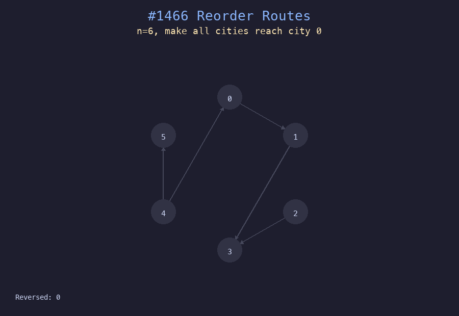

# 1466. 重新规划路线

## 题目描述
`n` 座城市，从 `0` 到 `n-1` 编号，城市间有 `n-1` 条路线。找出使所有城市都可以到达城市 `0` 所需要反转的最少路线数目。

## 解题思路
1. 从城市 0 出发进行 BFS
2. 对于每条边，判断其方向是否远离城市 0
3. 如果原始方向是从 BFS 层近端指向远端（远离 0），则需要反转
4. 统计需要反转的边数

## 代码
```python
def minReorder(n: int, connections: list[list[int]]) -> int:
    adj = [[] for _ in range(n)]
    original = set()
    for u, v in connections:
        adj[u].append(v)
        adj[v].append(u)
        original.add((u, v))
    visited = {0}
    queue = [0]
    count = 0
    while queue:
        city = queue.pop(0)
        for nb in adj[city]:
            if nb not in visited:
                visited.add(nb)
                queue.append(nb)
                if (city, nb) in original:
                    count += 1
    return count
```

## 动画演示


## 复杂度分析
- **时间复杂度**: O(n)，每条边和每个节点访问一次
- **空间复杂度**: O(n)，用于邻接表和 visited 集合
