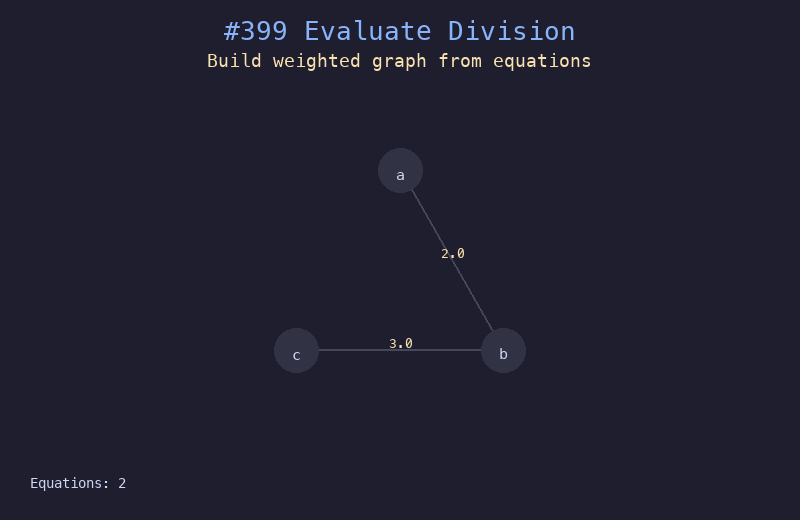

# 399. 除法求值

## 题目描述
给你一组变量对 `equations` 和对应的值 `values`，其中 `equations[i] = [Ai, Bi]` 且 `values[i]` 表示 `Ai / Bi = values[i]`。给定一些查询 `queries`，求每个查询的结果。

## 解题思路
1. 将除法关系建模为加权有向图，a/b = k 表示 a->b 权重 k，b->a 权重 1/k
2. 对于每个查询，用 BFS 搜索从起点到终点的路径
3. 路径上的权重相乘即为查询结果，找不到路径返回 -1.0

## 代码
```python
from collections import deque

def calcEquation(equations, values, queries):
    graph = {}
    for (a, b), val in zip(equations, values):
        graph.setdefault(a, []).append((b, val))
        graph.setdefault(b, []).append((a, 1.0 / val))

    def bfs(src, dst):
        if src not in graph or dst not in graph:
            return -1.0
        if src == dst:
            return 1.0
        visited = {src}
        queue = deque([(src, 1.0)])
        while queue:
            node, product = queue.popleft()
            for nb, weight in graph[node]:
                if nb == dst:
                    return product * weight
                if nb not in visited:
                    visited.add(nb)
                    queue.append((nb, product * weight))
        return -1.0

    return [bfs(s, d) for s, d in queries]
```

## 动画演示


## 复杂度分析
- **时间复杂度**: O(Q * (V + E))，其中 Q 是查询数，V 是变量数，E 是等式数
- **空间复杂度**: O(V + E)，用于存储图
