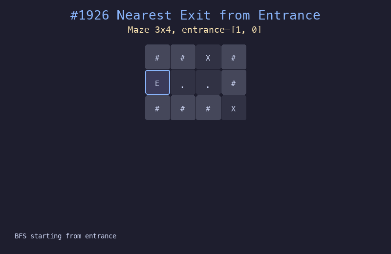

# 1926. 迷宫中离入口最近的出口

## 题目描述
给你一个 `m x n` 的迷宫矩阵 `maze`（由 `'.'` 和 `'+'` 组成），其中 `'.'` 表示空格，`'+'` 表示墙壁。给你迷宫的入口 `entrance`，找到离入口最近的出口（边界上的空格且不是入口）。

## 解题思路
1. 从入口开始进行 BFS，逐层扩展
2. 每一层代表距离入口的步数加一
3. 第一个到达边界空格（非入口）的位置即为最近出口
4. 如果 BFS 结束都没找到出口，返回 -1

## 代码
```python
from collections import deque

def nearestExit(maze, entrance):
    rows, cols = len(maze), len(maze[0])
    queue = deque([(entrance[0], entrance[1], 0)])
    visited = {(entrance[0], entrance[1])}
    while queue:
        r, c, steps = queue.popleft()
        if (r == 0 or r == rows-1 or c == 0 or c == cols-1) and [r,c] != entrance:
            return steps
        for dr, dc in [(0,1),(0,-1),(1,0),(-1,0)]:
            nr, nc = r+dr, c+dc
            if 0 <= nr < rows and 0 <= nc < cols and maze[nr][nc] == '.' and (nr,nc) not in visited:
                visited.add((nr, nc))
                queue.append((nr, nc, steps+1))
    return -1
```

## 动画演示


## 复杂度分析
- **时间复杂度**: O(m * n)，最坏情况下访问所有格子
- **空间复杂度**: O(m * n)，用于 visited 集合和队列
