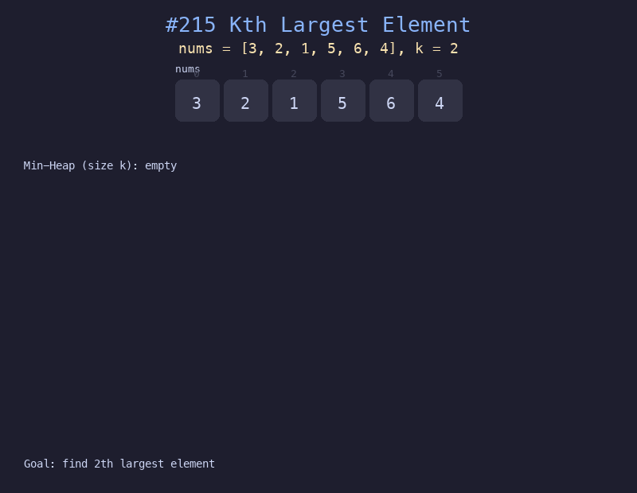

# 215. 数组中的第K个最大元素

## 题目描述
给定整数数组 `nums` 和整数 `k`，请返回数组中第 `k` 个最大的元素。注意是排序后第 `k` 大的元素，而不是第 `k` 个不同的元素。

## 解题思路
1. 维护一个大小为 k 的最小堆
2. 遍历数组，将元素加入堆中
3. 当堆大小超过 k 时，弹出堆顶（最小值）
4. 遍历结束后，堆顶就是第 k 大的元素

## 代码
```python
import heapq

def findKthLargest(nums: list[int], k: int) -> int:
    min_heap = []
    for num in nums:
        if len(min_heap) < k:
            heapq.heappush(min_heap, num)
        elif num > min_heap[0]:
            heapq.heapreplace(min_heap, num)
    return min_heap[0]
```

## 动画演示


## 复杂度分析
- **时间复杂度**: O(n log k)，每个元素最多进行一次堆操作
- **空间复杂度**: O(k)，堆的大小
