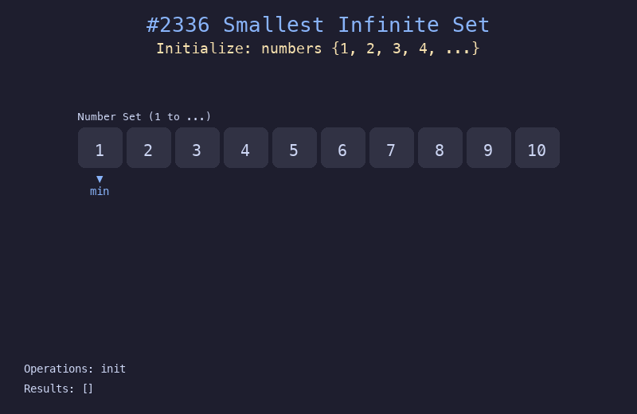

# 2336. 无限集中的最小数字

## 题目描述
现有一个包含所有正整数的集合 `{1, 2, 3, 4, ...}`。实现 `SmallestInfiniteSet` 类：
- `popSmallest()` 移除并返回该集合中的最小整数
- `addBack(num)` 如果 `num` 不在集合中，将其添加回集合

## 解题思路
1. 用一个变量 `nextNatural` 追踪下一个自然数（未被弹出的最小值）
2. 用一个有序集合（最小堆）存储被 addBack 回来且小于 nextNatural 的数
3. popSmallest 时优先从堆中取，否则返回 nextNatural 并递增
4. addBack 时只在数小于 nextNatural 且不在堆中时才加入

## 代码
```python
import heapq

class SmallestInfiniteSet:
    def __init__(self):
        self.next_natural = 1
        self.added_back = []  # min-heap
        self.added_set = set()

    def popSmallest(self) -> int:
        if self.added_back:
            val = heapq.heappop(self.added_back)
            self.added_set.remove(val)
            return val
        val = self.next_natural
        self.next_natural += 1
        return val

    def addBack(self, num: int) -> None:
        if num < self.next_natural and num not in self.added_set:
            heapq.heappush(self.added_back, num)
            self.added_set.add(num)
```

## 动画演示


## 复杂度分析
- **时间复杂度**: popSmallest O(log n)，addBack O(log n)，其中 n 是 addBack 调用次数
- **空间复杂度**: O(n)，用于存储被加回的元素
