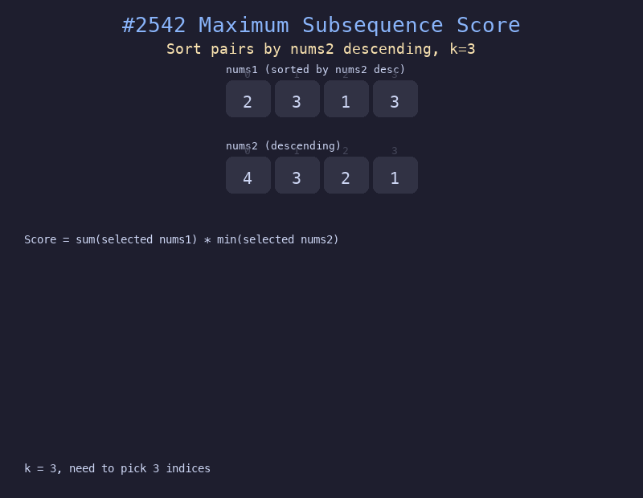

# 2542. 最大子序列的分数

## 题目描述
给你两个下标从 0 开始的整数数组 `nums1` 和 `nums2`，以及一个正整数 `k`。从下标中选出一个长度为 `k` 的子序列，分数定义为 `sum(选中的nums1元素) * min(选中的nums2元素)`。返回最大分数。

## 解题思路
1. 将 nums1 和 nums2 按 nums2 降序配对排序
2. 从左到右遍历，当前 nums2[i] 就是选中元素中 nums2 的最小值
3. 用大小为 k 的最小堆维护当前最大的 k 个 nums1 值的总和
4. 每次堆满 k 个时计算分数并更新最大值

## 代码
```python
import heapq

def maxScore(nums1, nums2, k):
    pairs = sorted(zip(nums2, nums1), reverse=True)
    min_heap = []
    heap_sum = 0
    max_score = 0
    for n2, n1 in pairs:
        heapq.heappush(min_heap, n1)
        heap_sum += n1
        if len(min_heap) > k:
            heap_sum -= heapq.heappop(min_heap)
        if len(min_heap) == k:
            max_score = max(max_score, heap_sum * n2)
    return max_score
```

## 动画演示


## 复杂度分析
- **时间复杂度**: O(n log n)，排序 O(n log n)，堆操作 O(n log k)
- **空间复杂度**: O(n)，用于排序和堆
