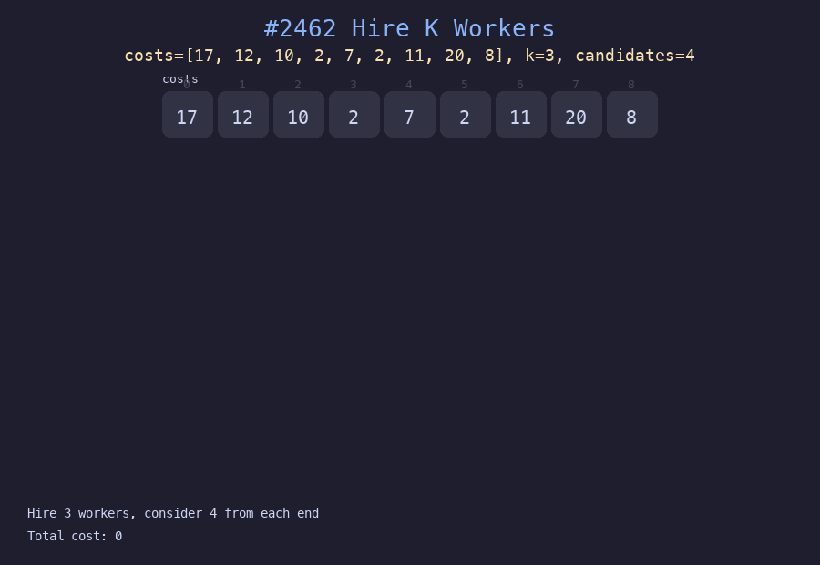

# 2462. 雇佣K位工人的总代价

## 题目描述
给你一个下标从 0 开始的整数数组 `costs`，其中 `costs[i]` 是雇佣第 `i` 位工人的代价。同时给你两个整数 `k` 和 `candidates`。每一轮雇佣中，从最前面 `candidates` 和最后面 `candidates` 中选出代价最小的工人雇佣。返回雇佣 `k` 位工人的总代价。

## 解题思路
1. 用两个最小堆分别维护左侧和右侧的候选工人
2. 每轮比较两个堆顶，选择代价更小的工人雇佣
3. 雇佣后从对应端补充新的候选人进堆
4. 重复 k 次，累计总代价

## 代码
```python
import heapq

def totalCost(costs, k, candidates):
    n = len(costs)
    left_heap, right_heap = [], []
    left, right = 0, n - 1
    for _ in range(candidates):
        if left <= right:
            heapq.heappush(left_heap, (costs[left], left))
            left += 1
    for _ in range(candidates):
        if left <= right:
            heapq.heappush(right_heap, (costs[right], right))
            right -= 1
    total = 0
    for _ in range(k):
        l = left_heap[0] if left_heap else (float('inf'),)
        r = right_heap[0] if right_heap else (float('inf'),)
        if l[0] <= r[0]:
            cost, idx = heapq.heappop(left_heap)
            if left <= right:
                heapq.heappush(left_heap, (costs[left], left))
                left += 1
        else:
            cost, idx = heapq.heappop(right_heap)
            if left <= right:
                heapq.heappush(right_heap, (costs[right], right))
                right -= 1
        total += cost
    return total
```

## 动画演示


## 复杂度分析
- **时间复杂度**: O((k + candidates) * log(candidates))，初始化和每轮堆操作
- **空间复杂度**: O(candidates)，两个堆的总大小
